# Spreo Capital · Phase 1 — the process, as flowcharts

**What this is.** The whole loan process Spreo OS commits to, drawn so it can be
walked step by step and confirmed or corrected. Every diagram answers the same
four questions: who does it · what is captured · what is generated or sent ·
what the system records.

**Where it comes from.** Dan's process document (31 Jul), his written answers
(9 Aug), the calls of 23 Jul – 11 Aug, and his permutations / needs list /
communications message filed 15 Sep 2026 — the newest source, which wins
wherever it differs. Verbatim sources are in `docs/sources/`.

**How to read the shapes**

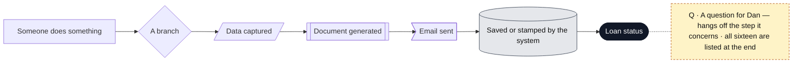

**Colour is the role doing the step**

```mermaid
flowchart LR
  lo["Loan Officer"] ~~~ cr["Credit"] ~~~ cm["Client Management"] ~~~ mg["Management / Internal UW"] ~~~ tp["Third-Party Review"] ~~~ cl["Closing"] ~~~ sy["The system, automatically"] ~~~ ex["Outside party"]
  classDef lo fill:#fde68a,stroke:#b45309,color:#111
  classDef credit fill:#bfdbfe,stroke:#1d4ed8,color:#111
  classDef cm fill:#bbf7d0,stroke:#15803d,color:#111
  classDef uw fill:#ddd6fe,stroke:#6d28d9,color:#111
  classDef tpr fill:#99f6e4,stroke:#0f766e,color:#111
  classDef closing fill:#fecdd3,stroke:#be123c,color:#111
  classDef sys fill:#e5e7eb,stroke:#374151,color:#111
  classDef ext fill:#fff,stroke:#6b7280,stroke-dasharray:4 3,color:#111
  class lo lo
  class cr credit
  class cm cm
  class mg uw
  class tp tpr
  class cl closing
  class sy sys
  class ex ext
```

**Contents**

1. [The whole journey](#1--the-whole-journey)
2. [Roles and what each one does](#2--roles-and-what-each-one-does)
3. [Stage 1 · Pre-Approval](#3--stage-1--pre-approval)
4. [The LOI package](#4--the-loi-package)
5. [Permutations → the Needs List](#5--permutations--the-needs-list)
6. [Stage 2 · Pre-Processing](#6--stage-2--pre-processing)
7. [Appraisal, budget, sponsor facts and dates](#7--appraisal-budget-sponsor-facts-and-dates)
8. [How a document is checked](#8--how-a-document-is-checked)
9. [Stages 3–5 · Processing, Internal Review, Investor Review](#9--stages-35--processing-internal-review-investor-review)
10. [Stage 6 · Loan documents and closing](#10--stage-6--loan-documents-and-closing)
11. [Every communication, in order](#11--every-communication-in-order)
12. [Outside systems and how each one connects](#12--outside-systems-and-how-each-one-connects)
13. [The borrower's side](#13--the-borrowers-side)
14. [Questions for Dan, in order](#14--questions-for-dan-in-order)

---

## 1 · The whole journey

Six stages. Credit owns the first; Client Management owns everything from the
signed LOI onward; Closing owns the last. One hard gate — into Processing. Two
dead-ends — Not Pre-Approved, and an unresolved No Fly match.

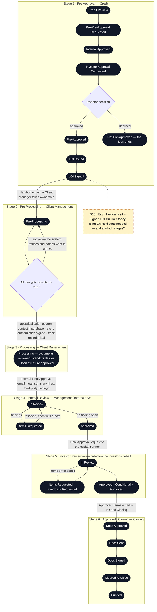

**What the system records at every step, on every loan**

| Recorded | Detail |
|---|---|
| Every status change | What it was, when, who did it, what caused it. Each leg of a back-and-forth is its own record |
| Days in current status | The only timing signal. No due dates, no SLAs, nothing is ever overdue |
| Every email | Template, recipients, sender, date/time, attachments. Replies are recorded by a person — the system never reads a mailbox |
| Every document event | Upload, replace, each review decision with its note. Nothing is deleted; superseded files stay in history |
| Every override | No Fly override, Processing-gate override — who, when, reason |
| Pulse | The pipeline view of all of the above. Read-only; each value names the tab where it is edited. Sort, pick and pin columns, totals, export to PDF and Excel |

**What the process produces — the reports**

| Report | When | What it is |
|---|---|---|
| The LOI package | Pre-Approval | LOI · liquidity requirement · authorization · loan checklist — see 4 |
| Loan Summary — the IC summary | Before Internal Review | The one-page story of the loan the underwriter and the investor both read |
| Investor tape | Final Approval | A short spreadsheet row for the capital partner — address, rate and a handful more |
| Servicing tape | After Funded | The spreadsheet handed to the loan servicer |
| Outstanding items by loan | Any time | Everything still open on a loan — the same list the recurring email sends |
| Appraisal and budget status | Any time | Where every order stands, promised against target |
| Timestamp report | Any time | Every status change on a loan with who and when — the accountability report |
| Custom export | Any time | Pick fields, get Excel |

---

## 2 · Roles and what each one does

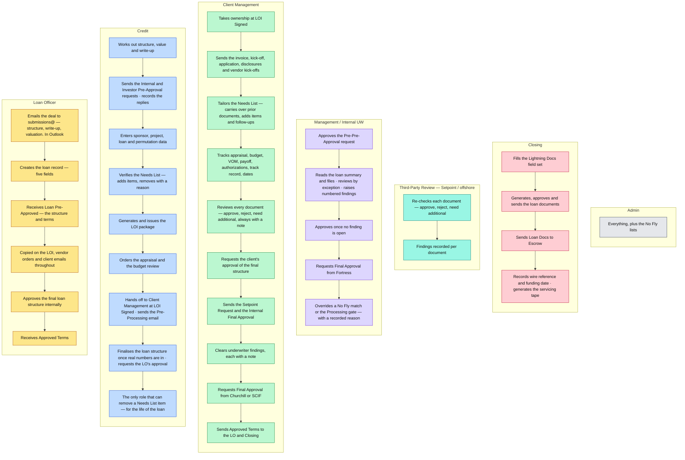

**Outside parties — none of them log in**

| Party | Touches the process how |
|---|---|
| Guarantors / the client | Sign the LOI and authorizations · receive the Needs List and the recurring email · upload through a personal portal link · sign application and disclosures via DocuSign · approve the final structure |
| Broker | Copied on the client emails · may carry the additional guarantors' authorizations · eight fields captured on the loan |
| Capital partner — Fortress, SCIF, Churchill | Pre-approves and finally approves by email · replies recorded by staff · receives the investor tape · Churchill also supplies a No Fly list |
| AMC / appraiser | Receives the order and trigger emails · sends invoice and report · status kept by hand |
| Budget vendor | Receives the Construction Order · receives budget and plans from the client · inspects · delivers the Scrub or Feasibility |
| Setpoint / offshore | Receives the Setpoint Request and the documents · returns findings per document |
| Title · Escrow · Legal · Flood | Receive kick-off and order emails · Title returns the updated estimated closing statement · Escrow receives the loan documents |
| Loan servicer | Receives the servicing tape after funding |

---

## 3 · Stage 1 · Pre-Approval

Credit owns this stage completely. The approval chain runs **before** the data
entry: Credit asks Dan, then the capital partner, and only then enters the
sponsor, project, loan and permutation data — right before the LOI is generated.

```mermaid
flowchart TD
  lo0>"Outlook, outside the system — the LO emails Credit at submissions@ with the loan structure, a write-up and a valuation"]
  lo0 --> lo1[/"The LO creates the loan — five fields and nothing else:<br/>Full address · Purchase or Refi · Portfolio Refi Y/N · Repeat Borrower Y/N · Approximate loan amount"/]
  lo1 --> s1[("Saved: the loan · status Credit Review · created by · date/time")]
  s1 --> cr0["Credit works out the structure, the value and the write-up — offline"]
  cr0 --> e1>"Email: Internal Pre-Approval Request — Credit to Management<br/>Subject merged with the address · body typed by Credit · attachments · recipients pre-set"]
  e1 --> s2[("Stamped: sent · status Pre-Pre-Approval Requested")]
  s2 --> r1["Dan replies in Outlook · Credit opens the send and records the outcome"]
  r1 --> q1{"Approved internally?"}
  q1 -->|"no — rework"| cr0
  q1 -->|"yes"| s3[("Status Internal Approved · date/time")]
  s3 --> cs[/"Credit sets the Capital Source — Fortress, SCIF, Churchill — the request cannot be addressed without it"/]
  cs --> e2>"Email: Investor Pre-Approval Request — Credit to the capital partner<br/>Subject merged · body typed · attachments"]
  e2 --> s4[("Stamped: sent · status Investor Approval Requested · request date/time")]
  s4 --> r2["The investor replies · Credit records the outcome"]
  r2 --> q2{"Investor decision"}
  q2 -->|"declined"| x1(["Not Pre-Approved — the loan ends here"])
  q2 -->|"approved"| s5[("Status Pre-Approved · approval date/time")]
  s5 --> e3>"Email: Loan Pre-Approved — Credit to the LO · the approved structure and terms"]
  e3 --> nx(["Continue below — data entry to LOI Signed"])
  e1 -.- q1x["Q1 · Guarantor names are not captured until after Pre-Approved, so the No Fly check runs after both approvals. Should the LO or Credit enter the names up front?"]
  x1 -.- q14["Q14 · A dead end — or back to Internal Approved with a different capital partner?"]
  classDef lo fill:#fde68a,stroke:#b45309,color:#111
  classDef credit fill:#bfdbfe,stroke:#1d4ed8,color:#111
  classDef sys fill:#e5e7eb,stroke:#374151,color:#111
  classDef status fill:#111827,stroke:#111827,color:#fff
  classDef ask fill:#fef3c7,stroke:#b45309,stroke-dasharray:4 3,color:#111
  class lo0,lo1 lo
  class cr0,cs,r1,r2,e1,e2,e3 credit
  class s1,s2,s3,s4,s5 sys
  class x1,nx status
  class q1x,q14 ask
```

**From data entry to the signed LOI.** Only now does Credit enter the loan's
data — the approval chain has already run on the write-up.

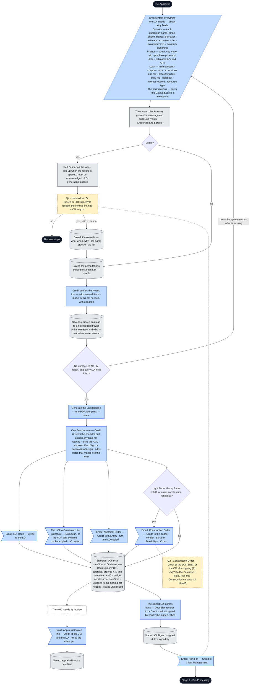

---

## 4 · The LOI package

One document, four parts, merged from the loan record. Guarantor 1 signs the
full packet. Every other guarantor gets a separate, shorter authorization.

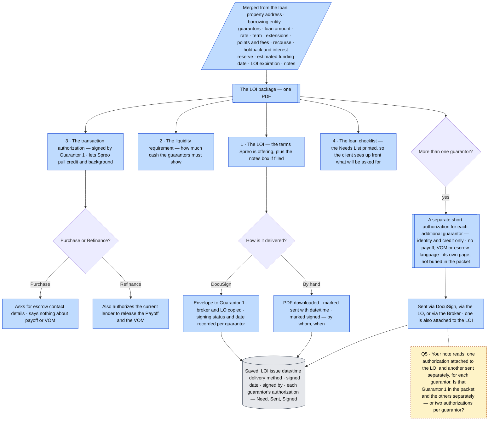

**Before it can be generated:** no unresolved No Fly match, and every field the
letter needs is filled — the system names the missing ones.

---

## 5 · Permutations → the Needs List

The one genuinely automatic thing in Phase 1. Credit saves the permutations;
the system builds the list. Credit then corrects it before anyone outside sees it.

```mermaid
flowchart TD
  cap[/"Captured by Credit — the permutations:<br/>Channel — Direct or Broker · Repeat Borrower · Repeat Broker · Global Required<br/>Transaction — Purchase · Cash-out Refi · No-cash-out Refi · Portfolio Refi · Mid Construction<br/>Property — SFR · 2-4 Unit · MFR · Lot Split · Condo Map · ADUs · Adding SF<br/>Loan type — Bridge · Light Reno · Heavy Reno · GUC · DSCR · Weather Tight<br/>Number of guarantors · Capital source — already set at the investor request"/]
  cap --> gen[("Saving them builds the Needs List")]
  cap -.- q7["Q7 · Condo Map — evidence of condo map? Lot Split, ADUs, Weather Tight, Repeat Broker, Portfolio Refi — what does each add or take away?"]
  gen --> std
  subgraph std["Standard Needs List — on every loan"]
    direction TB
    st1["For each guarantor: copy of Driver's License · Application via DocuSign · Authorization — one in the LOI packet, one sent separately via DocuSign, the LO or the Broker · last 2 months of consecutive personal bank statements · Schedule of Real Estate"]
    st2["Borrowing entity: last 2 months of consecutive entity bank statements · Operating Agreement"]
    st3["Signed Federal Disclosures via DocuSign"]
    st4["Track Record"]
  end
  st4 --> q0{"DSCR or RTL?"}
  q0 -->|"DSCR"| tr1["24 months of real-estate investment experience, including leases"]
  q0 -->|"RTL — Bridge, Light Reno, Heavy Reno, GUC"| tr2["List of stabilized or sold properties within the past 36 months"]
  tr1 --> q1
  tr2 --> q1{"Purchase or Refinance?"}
  q1 -->|"Purchase"| a1["+ PSA · + escrow contact information"]
  q1 -->|"Refinance"| a2["+ VOM · + Payoff · + latest mortgage statement"]
  a2 --> q2{"Mid-construction refinance?"}
  q2 -->|"yes"| a3["+ last inspection report from the previous lender · + Spend to Date details"]
  q2 -->|"no"| q3
  a1 --> q3
  a3 --> q3{"Direct or Broker?"}
  q3 -->|"Broker"| a4[/"Captured: Broker Name · Broker Company · Email · Phone · License Type · License No. · Broker Origination Fee (%) · Broker Processing Fee ($)"/]
  q3 -->|"Direct"| q4
  a4 --> q4{"More than one guarantor?"}
  q4 -->|"yes — for each additional guarantor"| a5["+ Signed Authorization · + copy of Driver's License · + completed and signed Application · + Schedule of Real Estate"]
  q4 -->|"no"| q5
  a5 --> q5{"Adding square footage?"}
  q5 -->|"yes"| a6["+ Plans"]
  q5 -->|"no"| q6
  a6 --> q6{"Loan type"}
  q6 -->|"Light Reno · Heavy Reno · GUC"| a7["+ Draft Budget · + Budget Review — Scrub or Feasibility · + Construction Inspection"]
  q6 -->|"DSCR"| a8["+ Subject property leases"]
  q6 -->|"Bridge"| q7
  a7 --> q7
  a8 --> q7{"Global Required?"}
  q7 -->|"yes"| a9["+ Personal tax returns · + investment statements"]
  q7 -->|"no"| q8
  a9 --> q8{"Capital source"}
  q8 -->|"Fortress · SCIF · Churchill"| a10["+ the partner's own items"]
  a10 --> int["Plus the internal items Spreo pulls itself — never shown to the borrower:<br/>credit report · background check · PACER · UCC search · sponsor search · org chart · VOM · Payoff"]
  int --> out[("The Needs List — one socket per item · which permutation produced it · borrower-facing Y/N · not visible to the client until the Kick-off Email")]
  a6 -.- q6["Q6 · Plans only when adding square footage — or for Heavy Reno and GUC as well?"]
  classDef credit fill:#bfdbfe,stroke:#1d4ed8,color:#111
  classDef sys fill:#e5e7eb,stroke:#374151,color:#111
  classDef ask fill:#fef3c7,stroke:#b45309,stroke-dasharray:4 3,color:#111
  class cap,a4 credit
  class gen,st1,st2,st3,st4,tr1,tr2,a1,a2,a3,a5,a6,a7,a8,a9,a10,int,out sys
  class q6,q7 ask
```

**A socket can hold several files.** Three months of bank statements are three
files in one socket. Each socket later carries its three review states — see 8.

**If the permutations change later** — a guarantor is added, the loan type
changes — new items are added. Items no longer needed are retired only if
nothing has been uploaded against them. Anything already submitted stays.

**Repeat Borrower.** Documents Spreo already holds from a prior loan with the
same guarantor can be carried across by the CM (see 6). That satisfies the
submission only — the file still goes through every review layer.

---

## 6 · Stage 2 · Pre-Processing

Starts the moment the LOI is signed. The Client Manager takes over. This is the
first time the client hears from Spreo about documents.

```mermaid
flowchart TD
  in(["LOI Signed"]) --> h>"Email: Hand-off — Credit to Client Management"]
  h --> cm0["A Client Manager takes ownership — assigned by hand, can be reassigned"]
  cm0 --> s0[("Status Pre-Processing · CM name · assignment date/time")]
  s0 --> e1>"Email: Pre-Processing — Credit to client and broker · LO copied<br/>Generic and immediate: repeats the checklist from the LOI · pay the appraisal, get the budget to the vendor, schedule the inspection, send your driver's licence and authorization · carries the appraisal invoice link"]
  e1 --> e2>"Email: Appraisal invoice — CM to the client · LO copied · the invoice link"]
  e2 --> s1[("Appraisal status Invoice Sent · date/time")]
  s1 --> tailor["The CM tailors the Needs List"]
  tailor --> q1{"Repeat Borrower — anything already on file from a prior loan?"}
  q1 -->|"yes"| carry["Carry the prior file across — counts as submitted only · still goes through Spreo and third-party review"]
  q1 -->|"no"| add
  carry --> add["The CM can add items and follow-up questions · cannot remove an item — asks Credit by email"]
  add --> pulls["As each signed authorization comes back, Spreo runs credit, background, PACER, UCC and a Google search on that guarantor — internal items, never on the client's list · anything found becomes a follow-up item under that guarantor · middle FICO recorded"]
  pulls --> e3>"Email: Kick-off — CM to the broker, Guarantor 1 and every other guarantor · LO copied<br/>The tailored Needs List in the email itself, plus each guarantor's personal portal link"]
  e3 --> s2[("Stamped: kick-off date/time · the client's view switches on")]
  s2 --> e4>"Email: Application — CM to each guarantor · DocuSign link"]
  e4 --> e5>"Email: Disclosures — CM to Guarantor 1 · DocuSign link"]
  e5 --> s3[("Saved per guarantor: application — Need, Sent, Signed + date · disclosures — Need, Sent, Signed + date · authorization — Need, Sent, Signed + date")]
  s3 --> e6>"Email: Title Kick-off — CM to the title company"]
  e6 --> e7>"Email: Escrow Kick-off — CM to the escrow company"]
  e7 --> q2{"Property in an attorney state?"}
  q2 -->|"yes"| e8>"Email: Legal Kick-off — CM to counsel · language varies by state"]
  q2 -->|"no"| e9
  e8 --> e9>"Email: Order Flood — CM to the flood vendor"]
  e9 --> s4[("Each send stamped: template · recipients · sender · date/time")]
  s4 --> rec>"Recurring Needs List — automatic, on behalf of Credit, to client and broker<br/>Daily at a set time · every workday · or chosen days and times each week<br/>Everything still outstanding in one message — documents, the unpaid invoice, the unscheduled inspection, what a vendor still needs · items drop off when done · wording is Outstanding and Under Review · no due dates"]
  s4 --> track["The CM keeps the operating facts current — see 7:<br/>appraisal · budget · VOM · Payoff · authorizations · track record · target dates"]
  track --> one>"Available any time as one-offs: Request Letter of Explanation · Order updated estimated closing statement from Title — also on the task list, carries the loan structure"]
  track --> gate{"Gate into Processing — all four true?<br/>1 · appraisal paid<br/>2 · escrow contact provided — purchase only<br/>3 · every guarantor authorization signed and received<br/>4 · track record at Initial"}
  gate -->|"no — the system refuses and names what is unmet"| track
  gate -->|"manager override, reason recorded"| proc
  gate -->|"yes"| proc(["Status Processing · date/time"])
  cm0 -.- q9["Q9 · How is the CM chosen — by rule from the LO, from a queue, or by hand?"]
  e1 -.- q3["Q3 · Sent by Credit (Sept) or by the CM (31 Jul)? It carries the invoice link and the CM sends a separate invoice email — are both intended?"]
  e3 -.- q10["Q10 · Is there a kick-off call with the client? Jonathan's sheet has a Kick-Off Call date"]
  s4 -.- q8["Q8 · Two emails on Jonathan's sheet are not on your list — VOM and Payoff Request to the current lender on a refinance, and Appraisal Invoice Request to the AMC. Do they exist?"]
  classDef credit fill:#bfdbfe,stroke:#1d4ed8,color:#111
  classDef cm fill:#bbf7d0,stroke:#15803d,color:#111
  classDef sys fill:#e5e7eb,stroke:#374151,color:#111
  classDef status fill:#111827,stroke:#111827,color:#fff
  classDef ask fill:#fef3c7,stroke:#b45309,stroke-dasharray:4 3,color:#111
  class h,e1 credit
  class cm0,e2,tailor,carry,add,e3,e4,e5,e6,e7,e8,e9,track,one cm
  class s0,s1,s2,s3,s4,rec,pulls sys
  class in,proc status
  class q3,q8,q9,q10 ask
```

**Attorney states** — the Legal Kick-off fires only here, and its language
varies by state: Alabama · Connecticut · Delaware · Florida · Georgia ·
Kentucky · Louisiana · Maine · Maryland · Massachusetts · Mississippi ·
New Hampshire · New York · North Carolina · North Dakota · Rhode Island ·
South Carolina · Vermont · West Virginia.

**A guarantor added later** gets only their own documents — their authorization,
application and driver's licence — not the whole list again.

**The Pre-Processing email is not the Kick-off.** The first is generic and goes
at once. The Kick-off is tailored and releases the list.

---

## 7 · Appraisal, budget, sponsor facts and dates

These are the facts Dan reads off the pipeline every day. The CM keeps them
current from Pre-Processing through Processing.

```mermaid
flowchart LR
  subgraph AP["Appraisal"]
    direction TB
    ap0[/"Captured: AMC · turn-around days · promised delivery date · target delivery date · appraiser needs — none, budget, plans, both · needs provided date/time · inspection scheduled date · inspection occurred date · invoice paid date/time"/]
    ap1(["Requested"]) --> ap2(["Invoice Sent"]) --> ap3(["Paid"]) --> ap4(["Received"]) --> ap5(["Under Review"])
    ap5 --> apq{"Value accepted?"}
    apq -->|"no — Spreo disputes it"| ap6(["Challenged — the order stays open"])
    ap6 --> ap5
    apq -->|"yes, budget still open"| ap7(["Approved Pending Budget"])
    apq -->|"yes"| ap8(["Final"])
    ap7 -->|"budget approved"| ap8
    ap4 --> apr[("Saved: the report in its socket · appraised AIV and ARV · received date/time · initial and final approval dates")]
  end
  subgraph BU["Budget — construction and renovation loans"]
    direction TB
    bu0[/"Captured: review type — Scrub or Feasibility · vendor needs — none, budget, plans, both · draft budget provided Y/N · draft plans provided Y/N · inspection scheduled date · inspection occurred date · promised delivery · target delivery"/]
    bu1(["Ordered"]) --> bu2["The client sends the draft budget and plans to the vendor"] --> bu3["Vendor inspection — a separate visit from the appraiser's"] --> bu4(["Received"]) --> bu5(["Under Review"]) --> bu6(["Approved"])
    bu6 --> bu7[("Saved: internally approved date/time · sent to the appraiser date/time · client sign-off date · final total budget")]
  end
  subgraph SP["Sponsor facts"]
    direction TB
    sp1[/"VOM — Not Ordered · Ordered · Received<br/>Payoff — Not Ordered · Ordered · Received<br/>Escrow contact provided — purchase only<br/>Authorization — Complete, or Need 1 … Need 6<br/>Track Record — No Initial · Initial · Complete<br/>Middle FICO per guarantor"/]
  end
  subgraph DT["Dates"]
    direction TB
    dt1[/"Captured: target submission date · target funding date · LOI funding date · PSA closing date · rate lock expiration"/]
    dt2[("Calculated submission date = the later of the appraisal and budget delivery dates")]
    dt3[("Calculated funding date = calculated submission + 4 business days")]
    dt4["Shown beside the targets so the gap is visible and someone can ask why"]
    dt1 --> dt2 --> dt3 --> dt4
  end
  classDef cm fill:#bbf7d0,stroke:#15803d,color:#111
  classDef sys fill:#e5e7eb,stroke:#374151,color:#111
  classDef ext fill:#fff,stroke:#6b7280,stroke-dasharray:4 3,color:#111
  classDef status fill:#111827,stroke:#111827,color:#fff
  class ap0,bu0,sp1,dt1,dt4 cm
  class apr,bu7,dt2,dt3 sys
  class bu2,bu3 ext
  class ap1,ap2,ap3,ap4,ap5,ap6,ap7,ap8,bu1,bu4,bu5,bu6 status
```

**Inspection is deliberately not a status.** It is separate facts — scheduled,
occurred, date — so a visit happening early or late does not push the order
backwards.

**Trigger emails to the two vendors** — automatic, conditions on the email
itself, not SLAs:

| Trigger | Fires when |
|---|---|
| Appraisal invoice unpaid | 48 hours after the invoice was sent |
| Inspection confirmation | The day after the scheduled inspection |
| Appraiser needs outstanding | Items requested and not yet provided |
| Delivery check-in | 48 hours before promised delivery |
| Budget vendor needs outstanding | Same pattern |
| Budget delivery check-in | Same pattern |

**Building the track record** — why it has three states rather than yes/no.
*Initial* is the list of addresses in hand; *Complete* is every one of them
connected to the guarantor.

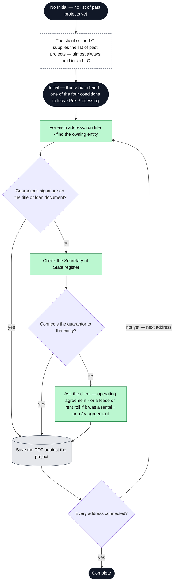

---

## 8 · How a document is checked

Three layers, in order: submission → Spreo review → third-party review. Every
decision carries a note, not only rejections. Nothing is ever deleted.

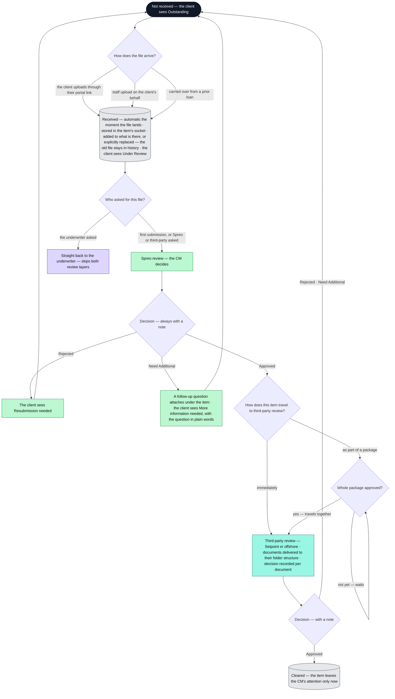

**Per guarantor, with dates.** The application, the disclosures and the
authorization are tracked on each guarantor — Need, Sent, Signed, and the date
received — so anyone can see at a person level who has signed what.

**What the client never sees:** internal items, Spreo's review states, third-party
states, approval. Only Outstanding · Under Review · Resubmission needed · More
information needed.

---

## 9 · Stages 3–5 · Processing, Internal Review, Investor Review

Processing is where documents flow and the vendors deliver. Once the real
numbers are in, Credit finalises the structure and the loan goes up the chain:
the LO, the client, Setpoint, internal management, the capital partner.

```mermaid
flowchart TD
  p0(["Processing"]) --> p1["Documents arrive and are reviewed — see 8 · vendors chased · appraisal and budget move to Final · FICO already known from the credit pull in Pre-Processing"]
  p1 --> q1{"Appraisal, budget and track record complete, and FICO known?"}
  q1 -->|"not yet"| p1
  q1 -->|"yes"| cr1[/"Credit finalises the loan structure from the real numbers — appraised AIV and ARV, the approved budget, FICO:<br/>final loan amount · holdback · interest reserve · rate · term · fees · UPB moves from Not Final to Final"/]
  cr1 --> e1>"Email: Internal Loan Structure Approval Request — Credit to the LO"]
  e1 --> q2{"LO approves?"}
  q2 -->|"no — revise"| cr1
  q2 -->|"yes"| e2>"Email: External Loan Structure Approval Request — CM to the client and broker"]
  e2 --> q3{"Client accepts?"}
  q3 -->|"no — revise"| cr1
  q3 -->|"yes"| s1[("Saved: the approved structure · internal and external approval date/time")]
  s1 --> e3>"Email: Setpoint Request — CM to Setpoint · review the package"]
  e3 --> tp["Everything shipped to third-party · findings come back per document — see 8 · internal review does not wait for all of them; findings are attached as they arrive"]
  tp --> g1[["Generate the Loan Summary — the IC summary — and the investor tape"]]
  g1 --> e4>"Email: Internal Final Approval — CM to Management / the internal underwriter<br/>The loan summary, the files and the third-party findings — the dry run for the investor package"]
  e4 --> s2[("Status In Review · date/time in")]
  s2 --> uw["The underwriter reviews by exception — what is wrong with the loan as a whole, not document by document"]
  uw --> q4{"Findings?"}
  q4 -->|"yes"| f1[/"Findings recorded as a numbered list, in the underwriter's own words"/]
  f1 --> s3[("Status Items Requested · date/time out")]
  s3 --> e5>"Email: Findings — to the CM and the working group · never to the client"]
  e5 --> cm1["The CM resolves each finding · every clearance carries a note · a resubmission the underwriter asked for goes straight back to the underwriter"]
  cm1 --> s2
  q4 -->|"none open"| s4[("Status Approved · date/time")]
  s4 --> q5{"Which capital partner?"}
  q5 -->|"Churchill or SCIF"| e6>"Email: Final Approval request — Client Management to the investor · the package and the investor tape"]
  q5 -->|"Fortress"| e7>"Email: Final Approval request — a principal to the investor · the package and the investor tape"]
  e6 --> s5
  e7 --> s5[("Status Investor In Review · date/time · who sent it")]
  s5 --> inv["The investor reads it in email — they never log in · staff record the reply on their behalf"]
  inv --> q6{"Investor reply"}
  q6 -->|"Items Requested · Feedback Requested"| cm2["The CM works the items · each leg stamped separately"]
  cm2 --> s5
  q6 -->|"Approved · Conditionally Approved"| s6[("Status Approved · conditions recorded · date/time")]
  s6 --> e8>"Email: Approved Terms — CM to the LO and to Closing"]
  e8 --> nx(["Stage 6 · Closing"])
  q2 -.- q12["Q12 · The request goes to the LO — is the LO the one who approves the structure?"]
  e3 -.- q11["Q11 · Documents already push to Setpoint as each is approved (31 Jul). Is the Setpoint Request a separate ask for the final report card — or does it replace the pushes?"]
  e4 -.- q13["Q13 · It goes to internal Management — which named individuals? Is this the same step as the internal underwriter's exception review? And which system role do the principals hold for the Fortress send?"]
  classDef credit fill:#bfdbfe,stroke:#1d4ed8,color:#111
  classDef cm fill:#bbf7d0,stroke:#15803d,color:#111
  classDef uw fill:#ddd6fe,stroke:#6d28d9,color:#111
  classDef tpr fill:#99f6e4,stroke:#0f766e,color:#111
  classDef sys fill:#e5e7eb,stroke:#374151,color:#111
  classDef ext fill:#fff,stroke:#6b7280,stroke-dasharray:4 3,color:#111
  classDef status fill:#111827,stroke:#111827,color:#fff
  classDef ask fill:#fef3c7,stroke:#b45309,stroke-dasharray:4 3,color:#111
  class cr1,e1 credit
  class p1,e2,e3,g1,e4,cm1,cm2,e6,e8 cm
  class uw,f1,e5,e7 uw
  class tp tpr
  class s1,s2,s3,s4,s5,s6 sys
  class inv ext
  class p0,nx status
  class q11,q12,q13 ask
```

**Who sends the Final Approval request is set per capital partner.** Today:
Client Management for Churchill and SCIF; a principal for Fortress.

**Nothing can be approved while a finding is open.** Each leg — in, out, back
in, approved — is stamped on its own.

---

## 10 · Stage 6 · Loan documents and closing

Closing owns this. The system merges everything it holds into the Lightning
Docs field set and shows it before generating anything.

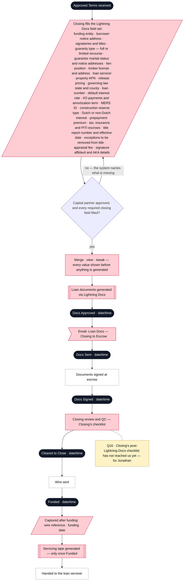

---

## 11 · Every communication, in order

Every send is composed from a template, addressed from the loan's own contacts,
stamped and logged. Every subject carries the property address; every footer
carries the loan number. Replies are recorded by a person.

Two emails open with a merged subject and an **empty body the sender types** —
the Internal and Investor Pre-Approval requests — because the content varies too
much to template. Everything else produces a full draft that can be edited.

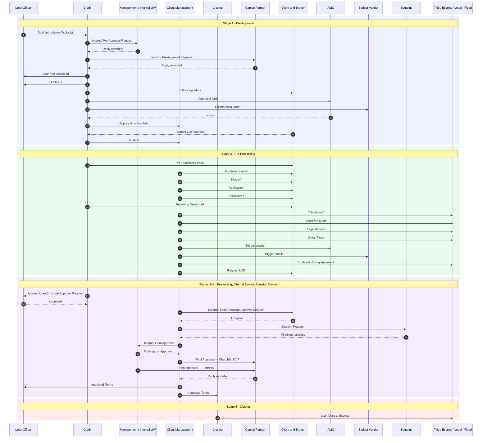

**Each one, in detail**

| # | Email | From → To | Copied | When | What it carries |
|---|---|---|---|---|---|
| 1 | Deal submission | LO → Credit | | The deal arrives | Structure, write-up, valuation. In Outlook, outside the system |
| 2 | Internal Pre-Approval Request | Credit → Management | LO | Credit has refined the deal | Subject merged with the address; **body typed**; attachments. Reply recorded → Internal Approved |
| 3 | Investor Pre-Approval Request | Credit → capital partner | LO | Internal Approved | Same shape, **body typed**. Reply recorded → Pre-Approved or Not Pre-Approved |
| 4 | Loan Pre-Approved | Credit → LO | | Pre-Approved | The approved structure and terms |
| 5 | LOI Issue | Credit → LO | | The One Send | The LOI package |
| 6 | LOI for signature | Credit → Guarantor 1 | Broker, LO | The One Send | DocuSign envelope, or the PDF by hand. Short authorizations to every other guarantor via DocuSign, the LO or the Broker |
| 7 | Appraisal Order | Credit → AMC | CM, LO | The One Send | The order to the chosen AMC |
| 8 | Construction Order | Credit → budget vendor | **bcc** LO | The One Send — renovation, construction and mid-construction refi only | Scrub or Feasibility. The only bcc in the system |
| 9 | Appraisal invoice link | Credit → CM | LO | The AMC invoices | The link. Not to the client yet |
| 10 | Hand-off | Credit → Client Management | | LOI Signed | Ownership passes |
| 11 | Pre-Processing | Credit → client, broker | LO | Immediately after hand-off | Generic: pay the appraisal, budget to the vendor, schedule the inspection. Carries the invoice link |
| 12 | Appraisal invoice | CM → client | LO | After the Pre-Processing email | The invoice link → appraisal status Invoice Sent |
| 13 | Kick-off | CM → broker, Guarantor 1, every other guarantor | LO | The list is tailored | The tailored Needs List in the email, plus a personal portal link per guarantor. Switches the client's view on |
| 14 | Application | CM → each guarantor | | After kick-off | DocuSign link |
| 15 | Disclosures | CM → Guarantor 1 | | After kick-off | DocuSign link |
| 16 | Recurring Needs List | on behalf of Credit → client, broker | | On a schedule: daily at a set time, every workday, or chosen days and times each week | Everything still outstanding — documents, the unpaid invoice, the unscheduled inspection, vendor needs. Wording: Outstanding, Under Review. No due dates. Items drop off when done |
| 17 | Title Kick-off | CM → title company | | Pre-Processing | |
| 18 | Escrow Kick-off | CM → escrow company | | Pre-Processing | |
| 19 | Legal Kick-off | CM → counsel | | Pre-Processing, attorney states only | Language varies by state |
| 20 | Order Flood | CM → flood vendor | | Pre-Processing | |
| 21 | Trigger emails | automatic → AMC, budget vendor | | When a condition is met — see 7 | Invoice unpaid, inspection confirmation, needs outstanding, delivery check-in |
| 22 | Updated estimated closing statement | CM → Title | | On the task list, and any time as a one-off | Carries the loan structure |
| 23 | Request Letter of Explanation | CM → client | | Any time, one-off only | The question being asked |
| 24 | Internal Loan Structure Approval Request | Credit → LO | | Appraisal, budget and track record complete, FICO known | The final structure |
| 25 | External Loan Structure Approval Request | CM → client, broker | | LO has approved | The final structure |
| 26 | Setpoint Request | CM → Setpoint | | Structure approved | Review the package. Findings recorded per document |
| 27 | Internal Final Approval | CM → Management / internal UW | | Third-party findings in | The loan summary, the files, the third-party findings. → In Review |
| 28 | Findings | Management / UW → CM and working group | | Underwriter sends back | Numbered findings. **Never to the client.** → Items Requested |
| 29 | Final Approval request | CM → Churchill or SCIF · a principal → Fortress | | Internal Review approved | The package and the investor tape. **Who sends is set per capital partner.** Reply recorded on the investor's behalf |
| 30 | Approved Terms | CM → LO and Closing | | Investor approved | The approved terms |
| 31 | Loan Docs | Closing → Escrow | | Docs Approved | The loan documents → Docs Sent |

---

## 12 · Outside systems and how each one connects

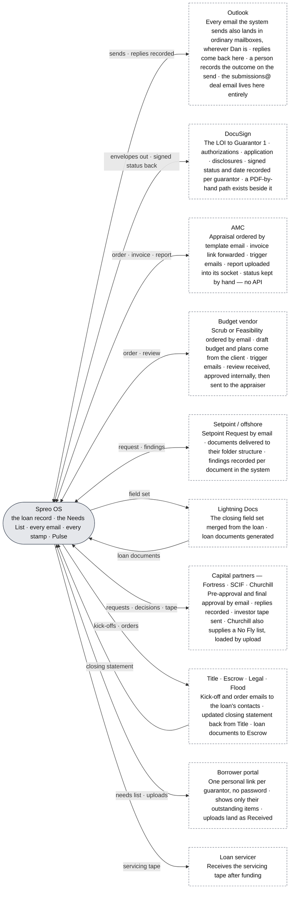

**Not connected in Phase 1:** automated credit or background pulls · an API into
any AMC's system · pushing documents into Churchill's Streamline · text
messaging · an inbox inside the system · workflow configuration · AI.

---

## 13 · The borrower's side

Runs alongside from Stage 2 onward. Each guarantor gets their own link. Almost
nobody will use the portal, so the Needs List always travels in the email too.

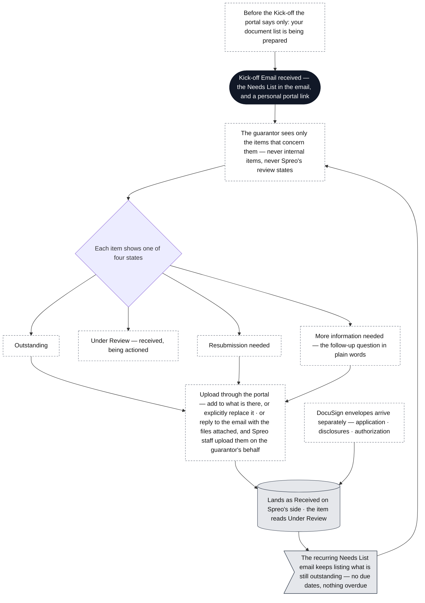

**No deadlines on the client's screen.** Each loan has its own delay points
outside the client's control — an entity has to exist before it can have a bank
account, and a bank account before it can have statements.

---

## 14 · Questions for Dan, in order

Each one hangs off the step it concerns in the diagrams above. Once answered,
the box comes off and the diagram is corrected; the answer is recorded here.

| Q | Where | The question | What the flowchart shows today |
|---|---|---|---|
| Q1 | §3 · before the Pre-Pre-Approval email | Guarantor names are not captured until after Pre-Approved, so the No Fly check runs after both approvals. Should the LO or Credit enter the names up front? | Names entered after Pre-Approved; No Fly runs then |
| Q2 | §3 · the One Send | Construction Order — Credit at the LOI (Sept), or the CM after signing (31 Jul)? Do the Purchase / Refi / Refi-Mid-Construction variants still stand? | Credit, at the One Send, for renovation, construction and mid-construction refi |
| Q3 | §6 · Pre-Processing email | Sent by Credit (Sept) or by the CM (31 Jul)? It carries the invoice link and the CM sends a separate invoice email — are both intended? | Credit sends it with the link; the CM sends the invoice email as well |
| Q4 | §3 · Hand-off | At LOI Issued or LOI Signed? If Issued, the invoice link has a CM to go to | LOI Signed |
| Q5 | §4 · authorizations | "One attached to LOI and other sent separately, for each guarantor" — Guarantor 1 in the packet and the others separately, or two authorizations per guarantor? | Guarantor 1 signs the packet; every other guarantor gets one short authorization |
| Q6 | §5 · Adding SF | Plans only when adding square footage — or for Heavy Reno and GUC as well? | Adding SF only |
| Q7 | §5 · permutations | Condo Map — evidence of condo map? Lot Split, ADUs, Weather Tight, Repeat Broker, Portfolio Refi — what does each add or take away? | Captured; nothing added |
| Q8 | §6 · the vendor emails | Two emails on Jonathan's sheet are not on your list — VOM and Payoff Request to the current lender on a refinance, and Appraisal Invoice Request to the AMC. Do they exist? | Neither drawn |
| Q9 | §6 · CM assigned | How is the CM chosen — by rule from the LO, from a queue, or by hand? | By hand, reassignable |
| Q10 | §6 · Kick-off | Is there a kick-off call with the client? Jonathan's sheet has a Kick-Off Call date | No call drawn |
| Q11 | §8 · §9 · Setpoint | Documents already push to Setpoint as each is approved. Is the Setpoint Request a separate ask for the final report card — or does it replace the pushes? | Both: per-document pushes in §8, one Setpoint Request in §9 |
| Q12 | §9 · structure approval | The Internal Loan Structure Approval Request goes to the LO — is the LO the one who approves the structure? | The LO approves |
| Q13 | §9 · Internal Final Approval | It goes to internal Management — which named individuals? Is this the same step as the internal underwriter's exception review? And which system role do the principals hold for the Fortress send? | One step, one role — Management / Internal UW |
| Q14 | §3 · Not Pre-Approved | A dead end — or back to Internal Approved with a different capital partner? | Dead end |
| Q15 | §1 · the journey | Eight live loans sit in Signed LOI On Hold today. Is an On Hold state needed — and at which stages? | No On Hold state |
| Q16 | §10 · Cleared to Close | Closing's post-Lightning-Docs checklist has not reached us yet — for Jonathan | A placeholder step |
