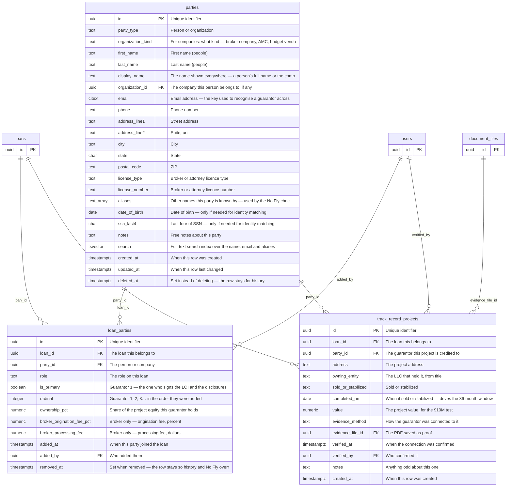
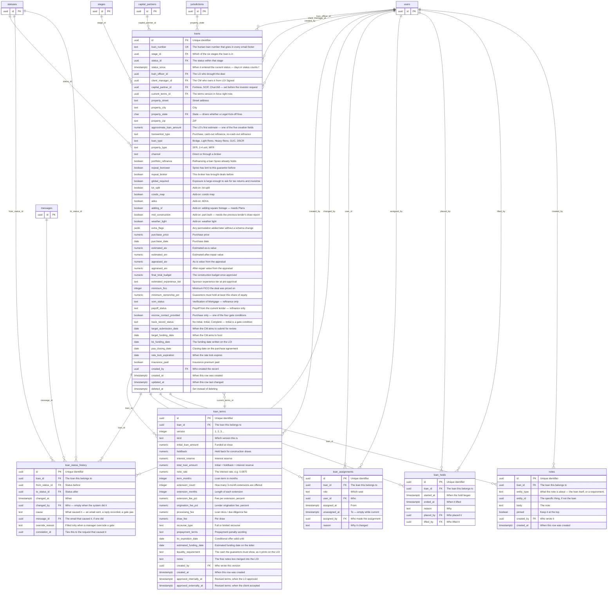
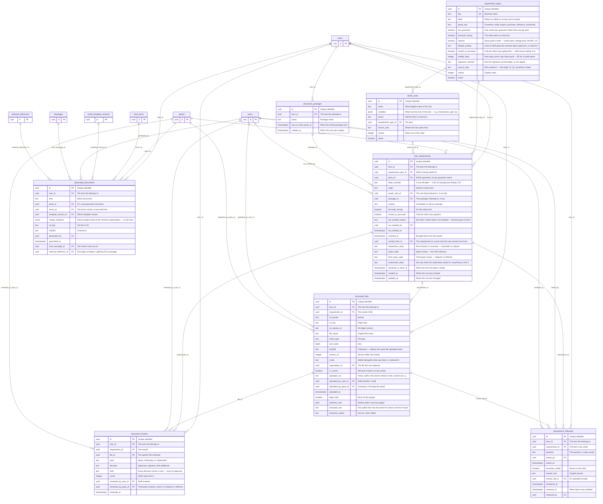
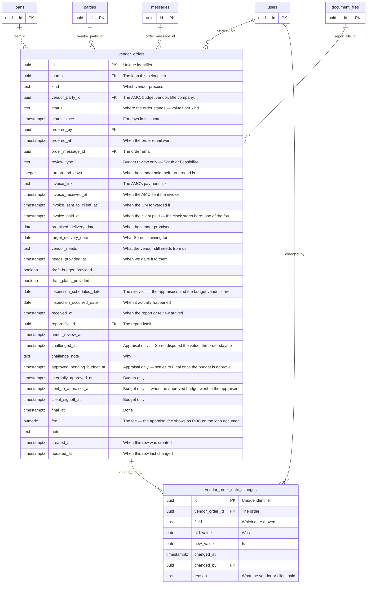
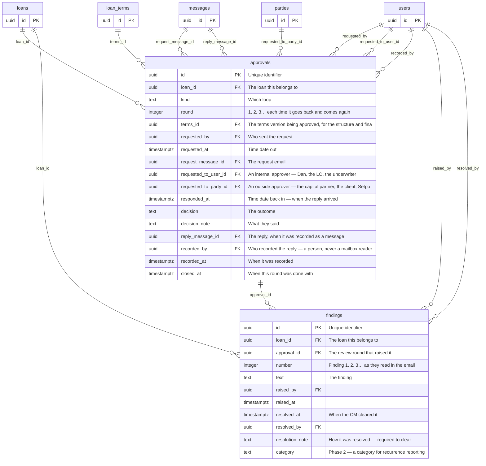
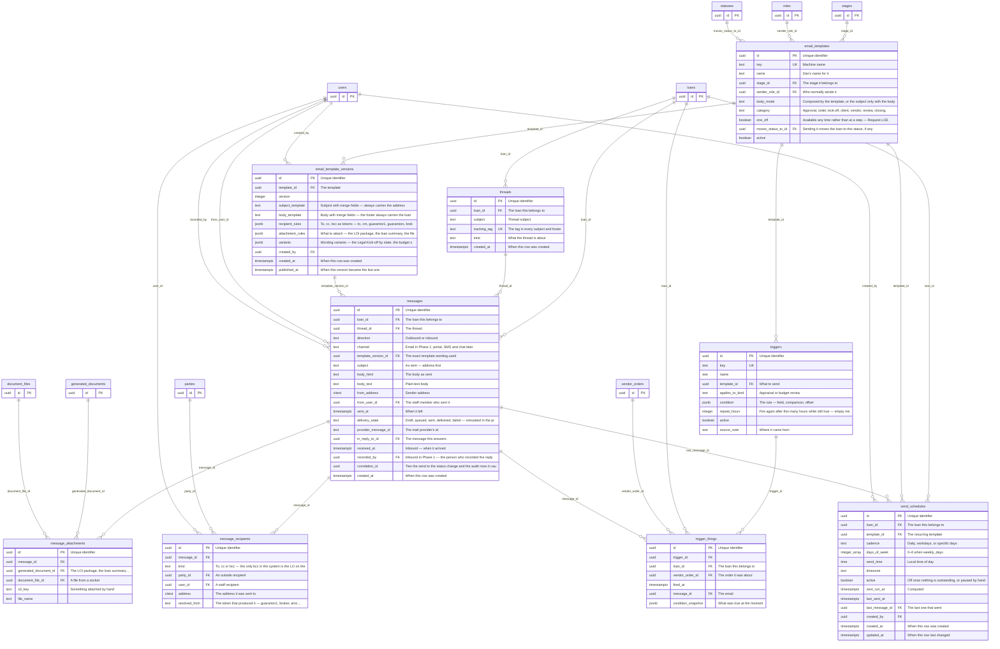
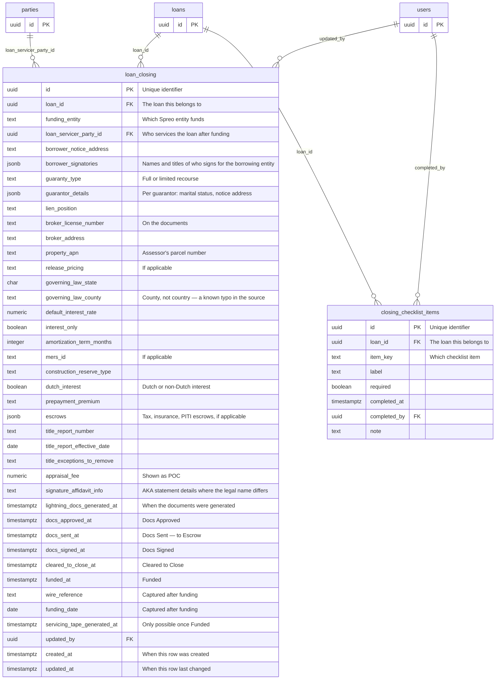
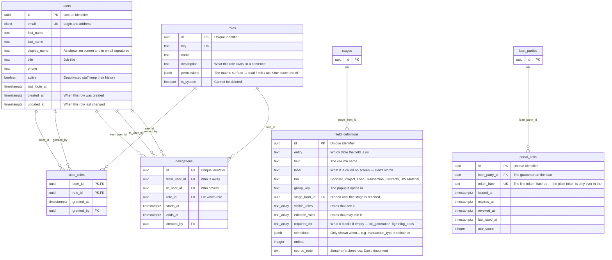

# Spreo OS · Phase 1 — the database schema

**What this is.** The target schema for the platform, generated from `database/ (model held in the build repo)` — the same model that
produces `database/schema.sql` (runnable PostgreSQL) and `08-database.html` (the visualizer for
non-technical review). 59 tables in 10 domains; 8 are defined
now and left empty so Phase 2 is additions only.

**Decisions it embodies.** People and companies exist once (`parties`) and link to loans. The process —
stages, statuses, transitions, needs rules, the document catalogue, templates, triggers, the role
matrix, field visibility — is data, seeded in Phase 1 and edited by screens in Phase 2. One shape per
concept: `approvals`, `vendor_orders`, `messages`. An append-only `events` table is the audit trail.
Files live in S3; the database holds keys and checksums. A `reporting` schema of views is served from
the read replica by a SELECT-only role. No tenant column — a second lender gets its own database.

**Diagrams.** One per domain. `PK` primary key · `FK` link to another table · a dotted entity is a table
from another domain shown for context.

---

## Parties — people and companies

Every person and company the process touches, stored once and linked to loans. A guarantor who comes back a year later is the same row, so what Spreo already holds on them can be found. Brokers, AMCs, budget vendors, title, escrow, attorneys, capital partners and servicers are all parties too.

### `parties`

A person or a company. One row, however many loans they appear on.

| Column | What it is | Type | Notes |
|---|---|---|---|
| `id` | Unique identifier | `uuid` | key |
| `party_type` | Person or organization | `text` | required · person · organization |
| `organization_kind` | For companies: what kind — broker company, AMC, budget vendor, title, escrow, law firm, flood vendor, insurance, capital partner, servicer, lender, third-party reviewer, borrowing entity | `text` | broker_company · amc · budget_vendor · title_company · escrow_company · law_firm · flood_vendor · insurance_agency · capital_partner · servicer · lender · third_party_reviewer · borrowing_entity · other |
| `first_name` | First name (people) | `text` |  |
| `last_name` | Last name (people) | `text` |  |
| `display_name` | The name shown everywhere — a person's full name or the company name | `text` | required |
| `organization_id` | The company this person belongs to, if any | `uuid` | → parties |
| `email` | Email address — the key used to recognise a guarantor across loans | `citext` |  |
| `phone` | Phone number | `text` |  |
| `address_line1` | Street address | `text` |  |
| `address_line2` | Suite, unit | `text` |  |
| `city` | City | `text` |  |
| `state` | State | `char(2)` |  |
| `postal_code` | ZIP | `text` |  |
| `license_type` | Broker or attorney licence type | `text` |  |
| `license_number` | Broker or attorney licence number | `text` |  |
| `aliases` | Other names this party is known by — used by the No Fly check | `text[]` |  |
| `date_of_birth` | Date of birth — only if needed for identity matching | `date` | sensitive |
| `ssn_last4` | Last four of SSN — only if needed for identity matching | `char(4)` | sensitive |
| `notes` | Free notes about this party | `text` |  |
| `search` | Full-text search index over the name, email and aliases | `tsvector` |  |
| `created_at` | When this row was created | `timestamptz` | required |
| `updated_at` | When this row last changed | `timestamptz` | required |
| `deleted_at` | Set instead of deleting — the row stays for history | `timestamptz` |  |

### `loan_parties`

Who plays what role on a loan. Guarantor 1, 2, 3 — the broker — the AMC — the title company — and so on.

| Column | What it is | Type | Notes |
|---|---|---|---|
| `id` | Unique identifier | `uuid` | key |
| `loan_id` | The loan this belongs to | `uuid` | required · → loans |
| `party_id` | The person or company | `uuid` | required · → parties |
| `role` | The role on this loan | `text` | required · guarantor · borrowing_entity · broker · amc · appraiser · budget_vendor · title · escrow · legal · flood · insurance · capital_partner · current_lender · servicer · third_party_reviewer |
| `is_primary` | Guarantor 1 — the one who signs the LOI and the disclosures | `boolean` | required |
| `ordinal` | Guarantor 1, 2, 3… in the order they were added | `integer` |  |
| `ownership_pct` | Share of the project equity this guarantor holds | `numeric(5,2)` |  |
| `broker_origination_fee_pct` | Broker only — origination fee, percent | `numeric(5,3)` |  |
| `broker_processing_fee` | Broker only — processing fee, dollars | `numeric(14,2)` |  |
| `added_at` | When this party joined the loan | `timestamptz` | required |
| `added_by` | Who added them | `uuid` | → users |
| `removed_at` | Set when removed — the row stays so history and No Fly overrides survive | `timestamptz` |  |

### `track_record_projects`

The past projects a sponsor claims, and how each one was connected to a guarantor. Initial = the list is in hand; Complete = every row verified.

| Column | What it is | Type | Notes |
|---|---|---|---|
| `id` | Unique identifier | `uuid` | key |
| `loan_id` | The loan this belongs to | `uuid` | required · → loans |
| `party_id` | The guarantor this project is credited to | `uuid` | required · → parties |
| `address` | The project address | `text` | required |
| `owning_entity` | The LLC that held it, from title | `text` |  |
| `sold_or_stabilized` | Sold or stabilized | `text` | sold · stabilized |
| `completed_on` | When it sold or stabilized — drives the 36-month window | `date` |  |
| `value` | The project value, for the $10M test | `numeric(14,2)` |  |
| `evidence_method` | How the guarantor was connected to it | `text` | title_signature · secretary_of_state · operating_agreement · lease_or_rent_roll · jv_agreement |
| `evidence_file_id` | The PDF saved as proof | `uuid` | → document_files |
| `verified_at` | When the connection was confirmed | `timestamptz` |  |
| `verified_by` | Who confirmed it | `uuid` | → users |
| `notes` | Anything odd about this one | `text` |  |
| `created_at` | When this row was created | `timestamptz` | required |

---

## Loans — the record

The loan itself: where the property is, what kind of loan it is, the permutations that drive the Needs List, where it sits in the process, who owns it, and the facts Dan reads off the pipeline. Terms are versioned so the LOI, the revised structure and the final terms all survive.

### `loans`

One row per loan. The five creation fields, the permutations, the pipeline facts and the pointers to everything else.

| Column | What it is | Type | Notes |
|---|---|---|---|
| `id` | Unique identifier | `uuid` | key |
| `loan_number` | The human loan number that goes in every email footer | `text` | required · unique |
| `stage_id` | Which of the six stages the loan is in | `uuid` | required · → stages |
| `status_id` | The status within that stage | `uuid` | required · → statuses |
| `status_since` | When it entered the current status — days in status counts from here | `timestamptz` | required |
| `loan_officer_id` | The LO who brought the deal | `uuid` | → users |
| `client_manager_id` | The CM who owns it from LOI Signed | `uuid` | → users |
| `capital_partner_id` | Fortress, SCIF, Churchill — set before the investor request | `uuid` | → capital_partners |
| `current_terms_id` | The terms version in force right now | `uuid` | → loan_terms |
| `property_street` | Street address | `text` | required |
| `property_city` | City | `text` |  |
| `property_state` | State — drives whether a Legal Kick-off fires | `char(2)` | → jurisdictions |
| `property_zip` | ZIP | `text` |  |
| `approximate_loan_amount` | The LO's first estimate — one of the five creation fields | `numeric(14,2)` |  |
| `transaction_type` | Purchase, cash-out refinance, no-cash-out refinance | `text` | purchase · cash_out_refi · no_cash_out_refi |
| `loan_type` | Bridge, Light Reno, Heavy Reno, GUC, DSCR | `text` | bridge · light_reno · heavy_reno · guc · dscr |
| `property_type` | SFR, 2-4 unit, MFR | `text` | sfr · two_to_four · mfr |
| `channel` | Direct or through a broker | `text` | direct · broker |
| `portfolio_refinance` | Refinancing a loan Spreo already holds | `boolean` | required |
| `repeat_borrower` | Spreo has lent to this guarantor before | `boolean` | required |
| `repeat_broker` | This broker has brought deals before | `boolean` | required |
| `global_required` | Exposure is large enough to ask for tax returns and investment statements | `boolean` | required |
| `lot_split` | Add-on: lot split | `boolean` | required |
| `condo_map` | Add-on: condo map | `boolean` | required |
| `adus` | Add-on: ADUs | `boolean` | required |
| `adding_sf` | Add-on: adding square footage — needs Plans | `boolean` | required |
| `mid_construction` | Add-on: part-built — needs the previous lender's draw report and spend to date | `boolean` | required |
| `weather_tight` | Add-on: weather tight | `boolean` | required |
| `extra_flags` | Any permutation added later without a schema change | `jsonb` | required |
| `purchase_price` | Purchase price | `numeric(14,2)` |  |
| `purchase_date` | Purchase date | `date` |  |
| `estimated_aiv` | Estimated as-is value | `numeric(14,2)` |  |
| `estimated_arv` | Estimated after-repair value | `numeric(14,2)` |  |
| `appraised_aiv` | As-is value from the appraisal | `numeric(14,2)` |  |
| `appraised_arv` | After-repair value from the appraisal | `numeric(14,2)` |  |
| `final_total_budget` | The construction budget once approved | `numeric(14,2)` |  |
| `estimated_experience_tier` | Sponsor experience tier at pre-approval | `text` |  |
| `minimum_fico` | Minimum FICO the deal was priced on | `integer` |  |
| `minimum_ownership_pct` | Guarantors must hold at least this share of equity | `numeric(5,2)` |  |
| `vom_status` | Verification of Mortgage — refinance only | `text` | not_ordered · ordered · received |
| `payoff_status` | Payoff from the current lender — refinance only | `text` | not_ordered · ordered · received |
| `escrow_contact_provided` | Purchase only — one of the four gate conditions | `boolean` | required |
| `track_record_status` | No Initial, Initial, Complete — Initial is a gate condition | `text` | required · no_initial · initial · complete |
| `target_submission_date` | When the CM aims to submit for review | `date` |  |
| `target_funding_date` | When the CM aims to fund | `date` |  |
| `loi_funding_date` | The funding date written on the LOI | `date` |  |
| `psa_closing_date` | Closing date on the purchase agreement | `date` |  |
| `rate_lock_expiration` | When the rate lock expires | `date` |  |
| `insurance_paid` | Insurance premium paid | `boolean` | required |
| `created_by` | Who created the record | `uuid` | → users |
| `created_at` | When this row was created | `timestamptz` | required |
| `updated_at` | When this row last changed | `timestamptz` | required |
| `deleted_at` | Set instead of deleting | `timestamptz` |  |

### `loan_terms`

The loan's terms, versioned. The LOI is version 1; the revised structure after appraisal and budget is version 2; the final approved terms are the last. Nothing is overwritten.

| Column | What it is | Type | Notes |
|---|---|---|---|
| `id` | Unique identifier | `uuid` | key |
| `loan_id` | The loan this belongs to | `uuid` | required · → loans |
| `version` | 1, 2, 3… | `integer` | required |
| `kind` | Which version this is | `text` | required · loi · revised · final |
| `initial_loan_amount` | Funded at close | `numeric(14,2)` |  |
| `holdback` | Held back for construction draws | `numeric(14,2)` |  |
| `interest_reserve` | Interest reserve | `numeric(14,2)` |  |
| `total_loan_amount` | Initial + holdback + interest reserve | `numeric(14,2)` |  |
| `note_rate` | The interest rate, e.g. 0.0875 | `numeric(6,4)` |  |
| `term_months` | Loan term in months | `integer` |  |
| `extension_count` | How many 3-month extensions are offered | `integer` |  |
| `extension_months` | Length of each extension | `integer` |  |
| `extension_fee_pct` | Fee per extension, percent | `numeric(6,4)` |  |
| `origination_fee_pct` | Lender origination fee, percent | `numeric(6,4)` |  |
| `processing_fee` | Loan docs / due diligence fee | `numeric(14,2)` |  |
| `draw_fee` | Per draw | `numeric(14,2)` |  |
| `recourse_type` | Full or limited recourse | `text` | full · limited |
| `prepayment_terms` | Prepayment penalty wording | `text` |  |
| `loi_expiration_date` | Conditional offer valid until | `date` |  |
| `estimated_funding_date` | Estimated funding date on the letter | `date` |  |
| `liquidity_requirement` | The cash the guarantors must show, as it prints on the LOI | `text` |  |
| `notes` | The free notes box merged into the LOI | `text` |  |
| `created_by` | Who wrote this version | `uuid` | → users |
| `created_at` | When this row was created | `timestamptz` | required |
| `approved_internally_at` | Revised terms: when the LO approved | `timestamptz` |  |
| `approved_externally_at` | Revised terms: when the client accepted | `timestamptz` |  |

### `loan_status_history`

Every status change, one row each, with who and why. "Time date in, time date out" — each leg of a back-and-forth is its own row.

| Column | What it is | Type | Notes |
|---|---|---|---|
| `id` | Unique identifier | `uuid` | key |
| `loan_id` | The loan this belongs to | `uuid` | required · → loans |
| `from_status_id` | Status before | `uuid` | → statuses |
| `to_status_id` | Status after | `uuid` | required · → statuses |
| `changed_at` | When | `timestamptz` | required |
| `changed_by` | Who — empty when the system did it | `uuid` | → users |
| `cause` | What caused it — an email sent, a reply recorded, a gate passed, a manual move | `text` |  |
| `message_id` | The email that caused it, if one did | `uuid` | → messages |
| `override_reason` | Filled only when a manager overrode a gate | `text` |  |
| `correlation_id` | Ties this to the request that caused it | `uuid` |  |

### `loan_assignments`

Who has owned the loan in each role, over time. Reassigning writes a new row; the old one is closed, not deleted.

| Column | What it is | Type | Notes |
|---|---|---|---|
| `id` | Unique identifier | `uuid` | key |
| `loan_id` | The loan this belongs to | `uuid` | required · → loans |
| `role` | Which seat | `text` | required · loan_officer · client_manager · credit · closing |
| `user_id` | Who | `uuid` | required · → users |
| `assigned_at` | From | `timestamptz` | required |
| `unassigned_at` | To — empty while current | `timestamptz` |  |
| `assigned_by` | Who made the assignment | `uuid` | → users |
| `reason` | Why it changed | `text` |  |

### `loan_holds` — Phase 2, defined now

Reserved for Q15. If Dan wants an On Hold state, a hold is a row here — the loan keeps its stage and status underneath.

| Column | What it is | Type | Notes |
|---|---|---|---|
| `id` | Unique identifier | `uuid` | key |
| `loan_id` | The loan this belongs to | `uuid` | required · → loans |
| `started_at` | When the hold began | `timestamptz` | required |
| `ended_at` | When it lifted | `timestamptz` |  |
| `reason` | Why | `text` | required |
| `placed_by` | Who placed it | `uuid` | → users |
| `lifted_by` | Who lifted it | `uuid` | → users |

### `notes`

Free-form notes on a loan, or on one thing inside it — a document, a party, a vendor order.

| Column | What it is | Type | Notes |
|---|---|---|---|
| `id` | Unique identifier | `uuid` | key |
| `loan_id` | The loan this belongs to | `uuid` | required · → loans |
| `entity_type` | What the note is about — the loan itself, or a requirement, party, order | `text` | loan · loan_requirement · party · vendor_order · approval |
| `entity_id` | The specific thing, if not the loan | `uuid` |  |
| `body` | The note | `text` | required |
| `pinned` | Keep it at the top | `boolean` | required |
| `created_by` | Who wrote it | `uuid` | required · → users |
| `created_at` | When this row was created | `timestamptz` | required |

---

## Configuration — the process as data

The stages, statuses and the moves between them; the capital partners and who sends what to each; the attorney states; the No Fly lists; saved views. Phase 1 seeds these tables and shows no screens for them. Phase 2's admin studio is screens over these same tables.

```mermaid
erDiagram
  stages {
    uuid id PK "Unique identifier"
    text key UK "Machine name"
    text name "Display name"
    integer ordinal "Order across the top of every loan"
    uuid owner_role_id FK "Which role owns the stage"
  }
  statuses {
    uuid id PK "Unique identifier"
    uuid stage_id FK "Which stage it belongs to"
    text key UK "Machine name"
    text name "Display name — Dan's words"
    integer ordinal "Order within the stage"
    boolean is_terminal "The loan ends here — Not Pre-Approved"
  }
  status_transitions {
    uuid id PK "Unique identifier"
    uuid from_status_id FK "From"
    uuid to_status_id FK "To"
    text label "What the move is called on screen"
    text trigger_kind "What normally causes it — a person, an email being sent, a r"
    jsonb gate "Conditions that must hold — e.g. appraisal paid, escrow cont"
    boolean allows_override "A manager may pass the gate with a recorded reason"
    uuid override_role_id FK "Which role may override"
  }
  capital_partners {
    uuid id PK "Unique identifier"
    uuid party_id FK "The partner as an organization"
    text code UK "Short code"
    text name "Display name"
    uuid final_approval_sender_role_id FK "Who sends Final Approval — Client Management for Churchill a"
    uuid final_approval_sender_user_id FK "Or a named person — a principal for Fortress"
    jsonb pre_approval_recipients "Who receives the Investor Pre-Approval Request"
    jsonb final_approval_recipients "Who receives the Final Approval request"
    uuid no_fly_list_id FK "The partner's own No Fly list, if they supply one"
    boolean active
    timestamptz created_at "When this row was created"
    timestamptz updated_at "When this row last changed"
  }
  capital_partner_requirements {
    uuid id PK "Unique identifier"
    uuid capital_partner_id FK "The partner"
    uuid requirement_type_id FK "The document they want"
    jsonb condition "Only when… e.g. global required"
  }
  jurisdictions {
    char state PK "Two-letter state code"
    text name "State name"
    boolean attorney_required "Legal Kick-off fires here"
    text legal_kickoff_variant "Which wording variant of the Legal Kick-off to use"
    text notes "What the attorney is actually required for, where known"
  }
  no_fly_lists {
    uuid id PK "Unique identifier"
    text source "Whose list"
    text name "Display name"
    uuid capital_partner_id FK "The partner it belongs to, if any"
    timestamptz last_loaded_at "When it was last uploaded or synced"
    uuid loaded_by FK "Who loaded it"
  }
  no_fly_entries {
    uuid id PK "Unique identifier"
    uuid list_id FK "Which list"
    text full_name "The name as listed"
    text_array aliases "Other spellings and names"
    citext email "Email, if known"
    text phone "Phone, if known"
    text reason "Why they are on the list"
    timestamptz added_at
    uuid added_by FK
    timestamptz removed_at "Set instead of deleting"
  }
  no_fly_matches {
    uuid id PK "Unique identifier"
    uuid loan_id FK "The loan this belongs to"
    uuid party_id FK "The guarantor that matched"
    uuid entry_id FK "The list entry they matched"
    text matched_on "What matched"
    numeric score "Match strength, 0–1 — exact in Phase 1, fuzzy later"
    timestamptz detected_at
    uuid acknowledged_by FK "Who acknowledged the pop-up"
    timestamptz acknowledged_at
  }
  no_fly_overrides {
    uuid id PK "Unique identifier"
    uuid loan_id FK "The loan this belongs to"
    uuid match_id FK "The match being cleared"
    jsonb party_snapshot "Name and details at the time — survives removal"
    text reason "Why it was cleared"
    uuid overridden_by FK "The manager or admin"
    timestamptz overridden_at
  }
  assignment_rules {
    uuid id PK "Unique identifier"
    text kind "By loan officer, by broker, round-robin, load-balanced"
    jsonb match "When this rule applies"
    text assign_role "Which seat it fills"
    uuid assign_user_id FK "Who gets it"
    integer priority "Rules are tried in this order"
    boolean active
  }
  saved_views {
    uuid id PK "Unique identifier"
    uuid user_id FK "Whose view"
    text surface "Which screen — pipeline, documents, inboxes"
    text name "View name"
    jsonb columns "Columns, order, pinned"
    jsonb filters "Filters"
    jsonb sort "Sort"
    boolean shared "Visible to the whole team"
    boolean is_default "Opens by default"
    timestamptz created_at "When this row was created"
    timestamptz updated_at "When this row last changed"
  }
  settings {
    text key PK "Setting name"
    jsonb value "The value"
    text description "What it does"
    uuid updated_by FK
    timestamptz updated_at "When this row last changed"
  }
  roles {
    uuid id PK
  }
  parties {
    uuid id PK
  }
  users {
    uuid id PK
  }
  requirement_types {
    uuid id PK
  }
  loans {
    uuid id PK
  }
  roles ||--o{ stages : "owner_role_id"
  stages ||--o{ statuses : "stage_id"
  statuses ||--o{ status_transitions : "from_status_id"
  statuses ||--o{ status_transitions : "to_status_id"
  roles ||--o{ status_transitions : "override_role_id"
  parties ||--o{ capital_partners : "party_id"
  roles ||--o{ capital_partners : "final_approval_sender_role_id"
  users ||--o{ capital_partners : "final_approval_sender_user_id"
  no_fly_lists ||--o{ capital_partners : "no_fly_list_id"
  capital_partners ||--o{ capital_partner_requirements : "capital_partner_id"
  requirement_types ||--o{ capital_partner_requirements : "requirement_type_id"
  capital_partners ||--o{ no_fly_lists : "capital_partner_id"
  users ||--o{ no_fly_lists : "loaded_by"
  no_fly_lists ||--o{ no_fly_entries : "list_id"
  users ||--o{ no_fly_entries : "added_by"
  loans ||--o{ no_fly_matches : "loan_id"
  parties ||--o{ no_fly_matches : "party_id"
  no_fly_entries ||--o{ no_fly_matches : "entry_id"
  users ||--o{ no_fly_matches : "acknowledged_by"
  loans ||--o{ no_fly_overrides : "loan_id"
  no_fly_matches ||--o{ no_fly_overrides : "match_id"
  users ||--o{ no_fly_overrides : "overridden_by"
  users ||--o{ assignment_rules : "assign_user_id"
  users ||--o{ saved_views : "user_id"
  users ||--o{ settings : "updated_by"
```

### `stages`

The six stages: Pre-Approval, Pre-Processing, Processing, Internal Review, Investor Review, Approved / Closing.

| Column | What it is | Type | Notes |
|---|---|---|---|
| `id` | Unique identifier | `uuid` | key |
| `key` | Machine name | `text` | required · unique |
| `name` | Display name | `text` | required |
| `ordinal` | Order across the top of every loan | `integer` | required |
| `owner_role_id` | Which role owns the stage | `uuid` | → roles |

### `statuses`

Every status inside every stage, in order — Credit Review through Funded.

| Column | What it is | Type | Notes |
|---|---|---|---|
| `id` | Unique identifier | `uuid` | key |
| `stage_id` | Which stage it belongs to | `uuid` | required · → stages |
| `key` | Machine name | `text` | required · unique |
| `name` | Display name — Dan's words | `text` | required |
| `ordinal` | Order within the stage | `integer` | required |
| `is_terminal` | The loan ends here — Not Pre-Approved | `boolean` | required |

### `status_transitions`

Which status can move to which, what has to be true first, and whether a manager can override. The Processing gate is a row here.

| Column | What it is | Type | Notes |
|---|---|---|---|
| `id` | Unique identifier | `uuid` | key |
| `from_status_id` | From | `uuid` | required · → statuses |
| `to_status_id` | To | `uuid` | required · → statuses |
| `label` | What the move is called on screen | `text` |  |
| `trigger_kind` | What normally causes it — a person, an email being sent, a reply recorded, the system | `text` | manual · email_sent · reply_recorded · system |
| `gate` | Conditions that must hold — e.g. appraisal paid, escrow contact if purchase, all authorizations signed, track record Initial | `jsonb` | required |
| `allows_override` | A manager may pass the gate with a recorded reason | `boolean` | required |
| `override_role_id` | Which role may override | `uuid` | → roles |

### `capital_partners`

Fortress, SCIF, Churchill and any partner added later — with who sends the Final Approval request to each, and which extra documents each wants.

| Column | What it is | Type | Notes |
|---|---|---|---|
| `id` | Unique identifier | `uuid` | key |
| `party_id` | The partner as an organization | `uuid` | required · → parties |
| `code` | Short code | `text` | required · unique |
| `name` | Display name | `text` | required |
| `final_approval_sender_role_id` | Who sends Final Approval — Client Management for Churchill and SCIF | `uuid` | → roles |
| `final_approval_sender_user_id` | Or a named person — a principal for Fortress | `uuid` | → users |
| `pre_approval_recipients` | Who receives the Investor Pre-Approval Request | `jsonb` | required |
| `final_approval_recipients` | Who receives the Final Approval request | `jsonb` | required |
| `no_fly_list_id` | The partner's own No Fly list, if they supply one | `uuid` | → no_fly_lists |
| `active` |  | `boolean` | required |
| `created_at` | When this row was created | `timestamptz` | required |
| `updated_at` | When this row last changed | `timestamptz` | required |

### `capital_partner_requirements`

Extra Needs List items a particular capital partner asks for.

| Column | What it is | Type | Notes |
|---|---|---|---|
| `id` | Unique identifier | `uuid` | key |
| `capital_partner_id` | The partner | `uuid` | required · → capital_partners |
| `requirement_type_id` | The document they want | `uuid` | required · → requirement_types |
| `condition` | Only when… e.g. global required | `jsonb` |  |

### `jurisdictions`

The fifty states, flagged for whether an attorney is required — the nineteen attorney states get a Legal Kick-off with state-specific language.

| Column | What it is | Type | Notes |
|---|---|---|---|
| `state` | Two-letter state code | `char(2)` | key |
| `name` | State name | `text` | required |
| `attorney_required` | Legal Kick-off fires here | `boolean` | required |
| `legal_kickoff_variant` | Which wording variant of the Legal Kick-off to use | `text` |  |
| `notes` | What the attorney is actually required for, where known | `text` |  |

### `no_fly_lists`

The lists of people Spreo will not lend to. Churchill's and Spreo's own are separate, so a sync from Churchill only replaces Churchill's names.

| Column | What it is | Type | Notes |
|---|---|---|---|
| `id` | Unique identifier | `uuid` | key |
| `source` | Whose list | `text` | required · spreo · churchill · partner |
| `name` | Display name | `text` | required |
| `capital_partner_id` | The partner it belongs to, if any | `uuid` | → capital_partners |
| `last_loaded_at` | When it was last uploaded or synced | `timestamptz` |  |
| `loaded_by` | Who loaded it | `uuid` | → users |

### `no_fly_entries`

One row per name on a list, with the aliases, email and phone that help the match.

| Column | What it is | Type | Notes |
|---|---|---|---|
| `id` | Unique identifier | `uuid` | key |
| `list_id` | Which list | `uuid` | required · → no_fly_lists |
| `full_name` | The name as listed | `text` | required |
| `aliases` | Other spellings and names | `text[]` |  |
| `email` | Email, if known | `citext` |  |
| `phone` | Phone, if known | `text` |  |
| `reason` | Why they are on the list | `text` |  |
| `added_at` |  | `timestamptz` | required |
| `added_by` |  | `uuid` | → users |
| `removed_at` | Set instead of deleting | `timestamptz` |  |

### `no_fly_matches`

A hit: this guarantor on this loan matched this entry. Raises the banner and blocks LOI generation until overridden.

| Column | What it is | Type | Notes |
|---|---|---|---|
| `id` | Unique identifier | `uuid` | key |
| `loan_id` | The loan this belongs to | `uuid` | required · → loans |
| `party_id` | The guarantor that matched | `uuid` | required · → parties |
| `entry_id` | The list entry they matched | `uuid` | required · → no_fly_entries |
| `matched_on` | What matched | `text` | required · name · alias · email · phone |
| `score` | Match strength, 0–1 — exact in Phase 1, fuzzy later | `numeric(4,3)` |  |
| `detected_at` |  | `timestamptz` | required |
| `acknowledged_by` | Who acknowledged the pop-up | `uuid` | → users |
| `acknowledged_at` |  | `timestamptz` |  |

### `no_fly_overrides`

A manager cleared a match, with a reason. Keeps a snapshot of the party so the record survives even if the guarantor is later removed.

| Column | What it is | Type | Notes |
|---|---|---|---|
| `id` | Unique identifier | `uuid` | key |
| `loan_id` | The loan this belongs to | `uuid` | required · → loans |
| `match_id` | The match being cleared | `uuid` | required · → no_fly_matches |
| `party_snapshot` | Name and details at the time — survives removal | `jsonb` | required |
| `reason` | Why it was cleared | `text` | required |
| `overridden_by` | The manager or admin | `uuid` | required · → users |
| `overridden_at` |  | `timestamptz` | required |

### `assignment_rules` — Phase 2, defined now

Reserved for Q9. If CMs are assigned by rule — this LO always goes to this CM, or round-robin — the rule lives here.

| Column | What it is | Type | Notes |
|---|---|---|---|
| `id` | Unique identifier | `uuid` | key |
| `kind` | By loan officer, by broker, round-robin, load-balanced | `text` | required · by_loan_officer · by_broker · round_robin · load_balanced |
| `match` | When this rule applies | `jsonb` | required |
| `assign_role` | Which seat it fills | `text` | required |
| `assign_user_id` | Who gets it | `uuid` | → users |
| `priority` | Rules are tried in this order | `integer` | required |
| `active` |  | `boolean` | required |

### `saved_views`

A person's own pipeline view — which columns, in what order, pinned, filtered, sorted. Shared views for the team.

| Column | What it is | Type | Notes |
|---|---|---|---|
| `id` | Unique identifier | `uuid` | key |
| `user_id` | Whose view | `uuid` | required · → users |
| `surface` | Which screen — pipeline, documents, inboxes | `text` | required |
| `name` | View name | `text` | required |
| `columns` | Columns, order, pinned | `jsonb` | required |
| `filters` | Filters | `jsonb` | required |
| `sort` | Sort | `jsonb` | required |
| `shared` | Visible to the whole team | `boolean` | required |
| `is_default` | Opens by default | `boolean` | required |
| `created_at` | When this row was created | `timestamptz` | required |
| `updated_at` | When this row last changed | `timestamptz` | required |

### `settings`

Small platform settings that are not worth a table of their own — the default recurring cadence, the four business days for the calculated funding date, the prior-evidence validity window.

| Column | What it is | Type | Notes |
|---|---|---|---|
| `key` | Setting name | `text` | key |
| `value` | The value | `jsonb` | required |
| `description` | What it does | `text` |  |
| `updated_by` |  | `uuid` | → users |
| `updated_at` | When this row last changed | `timestamptz` | required |

---

## Needs List and documents

The catalogue of things Spreo can ask for, the rules that turn permutations into a list, the list itself on each loan (one socket per item, per guarantor where it applies), the files that fill the sockets as S3 versions, the three review layers, follow-up questions, packages, and everything the system generates — LOI, summaries, tapes, loan documents.

### `requirement_types`

The document catalogue — every item Spreo could ask for: driver's licence, application, bank statements, PSA, VOM, draft budget… with who sees it and how it travels to third-party review.

| Column | What it is | Type | Notes |
|---|---|---|---|
| `id` | Unique identifier | `uuid` | key |
| `key` | Machine name | `text` | required · unique |
| `label` | What it is called on screen and in emails | `text` | required |
| `group_key` | Guarantor, entity, project, purchase, refinance, construction, internal, closing | `text` | required · guarantor · entity · project · purchase · refinance · construction · dscr · internal · closing · partner |
| `per_guarantor` | One socket per guarantor rather than one per loan | `boolean` | required |
| `borrower_facing` | The client sees it on their list | `boolean` | required |
| `internal` | Spreo pulls it itself — credit report, background, PACER, UCC, Google search | `boolean` | required |
| `default_routing` | Goes to third-party the moment Spreo approves, or waits for its package | `text` | required · immediate · package |
| `locked_to_borrower` | Only the client may upload this — staff cannot satisfy it on their behalf | `boolean` | required |
| `validity_days` | How long a prior copy stays good — 90 for a credit report | `integer` |  |
| `signature_channel` | Sent for signature via DocuSign, or not signed | `text` | docusign · none |
| `source_note` | Who named it — Dan Sept, 31 Jul, Jonathan's sheet | `text` |  |
| `ordinal` | Display order | `integer` | required |
| `active` |  | `boolean` | required |

### `needs_rules`

The rules: when a loan looks like this, add (or remove) that item. Purchase → PSA and escrow contact; refinance → VOM, payoff, mortgage statement; DSCR → leases…

| Column | What it is | Type | Notes |
|---|---|---|---|
| `id` | Unique identifier | `uuid` | key |
| `name` | Plain-English name of the rule | `text` | required |
| `condition` | What must be true of the loan — e.g. {"transaction_type":"purchase"} | `jsonb` | required |
| `action` | Add the item or remove it | `text` | required · add · remove |
| `requirement_type_id` | The item | `uuid` | required · → requirement_types |
| `source_note` | Where the rule came from | `text` |  |
| `ordinal` | Rules run in this order | `integer` | required |
| `active` |  | `boolean` | required |

### `document_packages`

A group of items that travel to third-party review together — the sponsor package, for instance.

| Column | What it is | Type | Notes |
|---|---|---|---|
| `id` | Unique identifier | `uuid` | key |
| `loan_id` | The loan this belongs to | `uuid` | required · → loans |
| `name` | Package name | `text` | required |
| `sent_to_third_party_at` | When the whole package went | `timestamptz` |  |
| `created_at` | When this row was created | `timestamptz` | required |

### `loan_requirements`

The Needs List on a loan — one socket per item, per guarantor where it applies. Carries where the item came from, whether the client sees it, and its state in each of the three review layers.

| Column | What it is | Type | Notes |
|---|---|---|---|
| `id` | Unique identifier | `uuid` | key |
| `loan_id` | The loan this belongs to | `uuid` | required · → loans |
| `requirement_type_id` | What is being asked for | `uuid` | required · → requirement_types |
| `party_id` | Which guarantor, for per-guarantor items | `uuid` | → parties |
| `label_override` | A one-off label — "LOE for background finding 7/11" | `text` |  |
| `origin` | Where it came from | `text` | required · rule · partner · credit_added · cm_added · third_party_added · underwriter_added · carry_over |
| `needs_rule_id` | The rule that produced it, if one did | `uuid` | → needs_rules |
| `package_id` | The package it belongs to, if any | `uuid` | → document_packages |
| `routing` | Immediate or with its package | `text` | required · immediate · package |
| `borrower_facing` | On the client's list | `boolean` | required |
| `locked_to_borrower` | Only the client may upload it | `boolean` | required |
| `not_needed_reason` | Set when Credit marks it not needed — the item goes to the drawer, never deleted | `text` |  |
| `not_needed_by` |  | `uuid` | → users |
| `not_needed_at` |  | `timestamptz` |  |
| `restored_at` | Brought back from the drawer | `timestamptz` |  |
| `carried_from_id` | The requirement on a prior loan this was carried over from | `uuid` | → loan_requirements |
| `submission_state` | Not received, or received — automatic on upload | `text` | required · not_received · received |
| `spreo_state` | Spreo review — the CM's decision | `text` | approved · rejected · need_additional |
| `third_party_state` | Third-party review — Setpoint or offshore | `text` | approved · rejected · need_additional |
| `underwriter_state` | Set only when the underwriter asked for something on this item | `text` | approved · rejected · need_additional |
| `released_to_client_at` | When the Kick-off made it visible | `timestamptz` |  |
| `created_at` | When this row was created | `timestamptz` | required |
| `updated_at` | When this row last changed | `timestamptz` | required |

### `document_files`

Every file ever uploaded, as a version. A socket can hold several — three months of bank statements are three files. Replacing keeps the old one; nothing is deleted. The file itself lives in S3.

| Column | What it is | Type | Notes |
|---|---|---|---|
| `id` | Unique identifier | `uuid` | key |
| `loan_id` | The loan this belongs to | `uuid` | required · → loans |
| `requirement_id` | The socket it fills | `uuid` | required · → loan_requirements |
| `s3_bucket` | Bucket | `text` | required |
| `s3_key` | Object key | `text` | required |
| `s3_version_id` | S3 object version | `text` |  |
| `file_name` | Original file name | `text` | required |
| `mime_type` | File type | `text` |  |
| `size_bytes` | Size | `bigint` |  |
| `sha256` | Checksum — detects the same file uploaded twice | `text` |  |
| `version_no` | Version within the socket | `integer` | required |
| `mode` | Added alongside what was there, or replaced it | `text` | required · append · replace |
| `supersedes_id` | The file this one replaced | `uuid` | → document_files |
| `is_current` | Still part of what is in the socket | `boolean` | required |
| `uploaded_via` | Portal, staff on the client's behalf, email, carried over, generated | `text` | required · portal · staff · email · carry_over · system |
| `uploaded_by_user_id` | Staff member, if staff | `uuid` | → users |
| `uploaded_by_party_id` | Guarantor, if through the portal | `uuid` | → parties |
| `uploaded_at` |  | `timestamptz` | required |
| `legal_hold` | Must not be purged | `boolean` | required · Phase 2 |
| `retention_until` | Earliest date it may be purged | `date` | Phase 2 |
| `extracted_text` | Text pulled from the document for search and the AI layer | `text` | Phase 2 |
| `extraction_status` | Not run, done, failed | `text` | pending · done · failed · Phase 2 |

### `document_reviews`

Every review decision on a file — which layer, what was decided, and the note that always goes with it.

| Column | What it is | Type | Notes |
|---|---|---|---|
| `id` | Unique identifier | `uuid` | key |
| `loan_id` | The loan this belongs to | `uuid` | required · → loans |
| `requirement_id` | The socket | `uuid` | required · → loan_requirements |
| `file_id` | The specific file reviewed | `uuid` | → document_files |
| `layer` | Spreo, third-party, or underwriter | `text` | required · spreo · third_party · underwriter |
| `decision` | Approved, rejected, need additional | `text` | required · approved · rejected · need_additional |
| `note` | Every decision carries a note — even an approval | `text` | required |
| `round` | Which pass this is | `integer` | required |
| `reviewed_by_user_id` | Staff reviewer | `uuid` | → users |
| `reviewed_by_party_id` | Third-party reviewer, when it is Setpoint or offshore | `uuid` | → parties |
| `reviewed_at` |  | `timestamptz` | required |

### `requirement_followups`

A follow-up question under an existing item — "letter of explanation for the background finding" — rather than a new item. Appears on the client's list in plain words.

| Column | What it is | Type | Notes |
|---|---|---|---|
| `id` | Unique identifier | `uuid` | key |
| `loan_id` | The loan this belongs to | `uuid` | required · → loans |
| `requirement_id` | The item it sits under | `uuid` | required · → loan_requirements |
| `question` | The question, in plain words | `text` | required |
| `asked_by` |  | `uuid` | required · → users |
| `asked_at` |  | `timestamptz` | required |
| `borrower_visible` | Shown to the client | `boolean` | required |
| `answer_text` | A typed answer | `text` |  |
| `answer_file_id` | An uploaded answer | `uuid` | → document_files |
| `answered_at` |  | `timestamptz` |  |
| `resolved_at` | When Spreo was satisfied | `timestamptz` |  |
| `resolved_by` |  | `uuid` | → users |

### `generated_documents`

Everything the system produces: the LOI package, each guarantor 2+ authorization, the loan checklist, the loan summary, the investor tape, the servicing tape, the Lightning Docs output. With the exact data it was merged from.

| Column | What it is | Type | Notes |
|---|---|---|---|
| `id` | Unique identifier | `uuid` | key |
| `loan_id` | The loan this belongs to | `uuid` | required · → loans |
| `kind` | Which document | `text` | required · loi_package · guarantor_authorization · loan_checklist · loan_summary · investor_tape · servicing_tape · loan_docs · packet |
| `party_id` | For a per-guarantor document | `uuid` | → parties |
| `terms_id` | The terms version it was built from | `uuid` | → loan_terms |
| `template_version_id` | Which template version | `uuid` | → email_template_versions |
| `merge_snapshot` | Every merged value at the moment of generation — so the document can always be explained | `jsonb` | required |
| `s3_key` | The file in S3 | `text` | required |
| `sha256` | Checksum | `text` |  |
| `generated_by` |  | `uuid` | → users |
| `generated_at` |  | `timestamptz` | required |
| `sent_message_id` | The email it went out on | `uuid` | → messages |
| `external_reference_id` | DocuSign envelope, Lightning Docs package | `uuid` | → external_references |

---

## Vendor work — appraisal, budget, title, escrow, legal, flood

Every order placed with an outside vendor, in one shape. The appraisal and the budget review carry the most — invoice, inspection, what the vendor still needs, promised against target — because those are the dates Dan manages the business on.

### `vendor_orders`

One order to one vendor on one loan. Kind says which: appraisal, budget review, title, escrow, legal, flood. Status values depend on the kind — the appraisal ladder is Requested → Invoice Sent → Paid → Received → Under Review → Challenged → Approved Pending Budget → Final.

| Column | What it is | Type | Notes |
|---|---|---|---|
| `id` | Unique identifier | `uuid` | key |
| `loan_id` | The loan this belongs to | `uuid` | required · → loans |
| `kind` | Which vendor process | `text` | required · appraisal · budget_review · title · escrow · legal · flood · insurance |
| `vendor_party_id` | The AMC, budget vendor, title company… | `uuid` | → parties |
| `status` | Where the order stands — values per kind | `text` | required |
| `status_since` | For days in this status | `timestamptz` | required |
| `ordered_by` |  | `uuid` | → users |
| `ordered_at` | When the order email went | `timestamptz` |  |
| `order_message_id` | The order email | `uuid` | → messages |
| `review_type` | Budget review only — Scrub or Feasibility | `text` | scrub · feasibility |
| `turnaround_days` | What the vendor said their turnaround is | `integer` |  |
| `invoice_link` | The AMC's payment link | `text` |  |
| `invoice_received_at` | When the AMC sent the invoice | `timestamptz` |  |
| `invoice_sent_to_client_at` | When the CM forwarded it | `timestamptz` |  |
| `invoice_paid_at` | When the client paid — the clock starts here; one of the four gate conditions | `timestamptz` |  |
| `promised_delivery_date` | What the vendor promised | `date` |  |
| `target_delivery_date` | What Spreo is aiming for | `date` |  |
| `vendor_needs` | What the vendor still needs from us | `text` | none · budget · plans · budget_and_plans |
| `needs_provided_at` | When we gave it to them | `timestamptz` |  |
| `draft_budget_provided` |  | `boolean` | required |
| `draft_plans_provided` |  | `boolean` | required |
| `inspection_scheduled_date` | The site visit — the appraiser's and the budget vendor's are different visits | `date` |  |
| `inspection_occurred_date` | When it actually happened | `date` |  |
| `received_at` | When the report or review arrived | `timestamptz` |  |
| `report_file_id` | The report itself | `uuid` | → document_files |
| `under_review_at` |  | `timestamptz` |  |
| `challenged_at` | Appraisal only — Spreo disputed the value; the order stays open | `timestamptz` |  |
| `challenge_note` | Why | `text` |  |
| `approved_pending_budget_at` | Appraisal only — settles to Final once the budget is approved | `timestamptz` |  |
| `internally_approved_at` | Budget only | `timestamptz` |  |
| `sent_to_appraiser_at` | Budget only — when the approved budget went to the appraiser | `timestamptz` |  |
| `client_signoff_at` | Budget only | `timestamptz` |  |
| `final_at` | Done | `timestamptz` |  |
| `fee` | The fee — the appraisal fee shows as POC on the loan documents | `numeric(14,2)` |  |
| `notes` |  | `text` |  |
| `created_at` | When this row was created | `timestamptz` | required |
| `updated_at` | When this row last changed | `timestamptz` | required |

### `vendor_order_date_changes`

Every time a promised or target date on an order moves, the old and new values. Dan wants to see the drift so he can manage vendors — "every time you told us you'd get it by X, you missed it by two days."

| Column | What it is | Type | Notes |
|---|---|---|---|
| `id` | Unique identifier | `uuid` | key |
| `vendor_order_id` | The order | `uuid` | required · → vendor_orders |
| `field` | Which date moved | `text` | required · promised_delivery_date · target_delivery_date · inspection_scheduled_date |
| `old_value` | Was | `date` |  |
| `new_value` | Is | `date` |  |
| `changed_at` |  | `timestamptz` | required |
| `changed_by` |  | `uuid` | → users |
| `reason` | What the vendor or client said | `text` |  |

---

## Approvals and reviews

Every ask-and-answer loop in the process, in one shape: the Pre-Pre-Approval to Dan, the investor pre-approval, the two loan-structure approvals, the Setpoint request, the internal final approval, the investor final approval. Each round is a row with the request stamped on one side and the reply on the other — so "it took you four days" can always be shown.

### `approvals`

One round of one approval loop on one loan. Round 2 is a new row. The request email and the recorded reply are both linked.

| Column | What it is | Type | Notes |
|---|---|---|---|
| `id` | Unique identifier | `uuid` | key |
| `loan_id` | The loan this belongs to | `uuid` | required · → loans |
| `kind` | Which loop | `text` | required · internal_pre_approval · investor_pre_approval · structure_internal · structure_external · third_party_review · internal_final · investor_final |
| `round` | 1, 2, 3… each time it goes back and comes again | `integer` | required |
| `terms_id` | The terms version being approved, for the structure and final loops | `uuid` | → loan_terms |
| `requested_by` | Who sent the request | `uuid` | required · → users |
| `requested_at` | Time date out | `timestamptz` | required |
| `request_message_id` | The request email | `uuid` | → messages |
| `requested_to_user_id` | An internal approver — Dan, the LO, the underwriter | `uuid` | → users |
| `requested_to_party_id` | An outside approver — the capital partner, the client, Setpoint | `uuid` | → parties |
| `responded_at` | Time date back in — when the reply arrived | `timestamptz` |  |
| `decision` | The outcome | `text` | approved · not_approved · conditionally_approved · items_requested · feedback_requested · accepted · declined |
| `decision_note` | What they said | `text` |  |
| `reply_message_id` | The reply, when it was recorded as a message | `uuid` | → messages |
| `recorded_by` | Who recorded the reply — a person, never a mailbox reader | `uuid` | → users |
| `recorded_at` | When it was recorded | `timestamptz` |  |
| `closed_at` | When this round was done with | `timestamptz` |  |

### `findings`

The underwriter's numbered list of what is wrong with the loan as a whole — in their own words, not marks on documents. Nothing approves while one is open. Clearing one needs a note.

| Column | What it is | Type | Notes |
|---|---|---|---|
| `id` | Unique identifier | `uuid` | key |
| `loan_id` | The loan this belongs to | `uuid` | required · → loans |
| `approval_id` | The review round that raised it | `uuid` | required · → approvals |
| `number` | Finding 1, 2, 3… as they read in the email | `integer` | required |
| `text` | The finding | `text` | required |
| `raised_by` |  | `uuid` | → users |
| `raised_at` |  | `timestamptz` | required |
| `resolved_at` | When the CM cleared it | `timestamptz` |  |
| `resolved_by` |  | `uuid` | → users |
| `resolution_note` | How it was resolved — required to clear | `text` |  |
| `category` | Phase 2 — a category for recurrence reporting | `text` | Phase 2 |

---

## Communications

Every email the system sends, and every reply a person records, on one loan thread with the tracking tag Dan asked for. Templates are versioned so an email can always be reproduced. The recurring Needs List and the vendor triggers live here too. Phase 2's inbound mail, texts and chat land in the same messages table with a different channel.

### `email_templates`

The named emails — Internal Pre-Approval Request, LOI Issue, Appraisal Order, Hand-off, Pre-Processing, Kick-off, Title Kick-off… about thirty. Two are body-typed rather than composed.

| Column | What it is | Type | Notes |
|---|---|---|---|
| `id` | Unique identifier | `uuid` | key |
| `key` | Machine name | `text` | required · unique |
| `name` | Dan's name for it | `text` | required |
| `stage_id` | The stage it belongs to | `uuid` | → stages |
| `sender_role_id` | Who normally sends it | `uuid` | → roles |
| `body_mode` | Composed by the template, or the subject only with the body typed by the sender | `text` | required · composed · manual |
| `category` | Approval, order, kick-off, client, vendor, review, closing, automatic | `text` | required · approval · order · kickoff · client · vendor · review · closing · automatic |
| `one_off` | Available any time rather than at a step — Request LOE | `boolean` | required |
| `moves_status_to_id` | Sending it moves the loan to this status, if any | `uuid` | → statuses |
| `active` |  | `boolean` | required |

### `email_template_versions`

The wording of a template at a point in time. A sent email always points at the exact version it used.

| Column | What it is | Type | Notes |
|---|---|---|---|
| `id` | Unique identifier | `uuid` | key |
| `template_id` | The template | `uuid` | required · → email_templates |
| `version` |  | `integer` | required |
| `subject_template` | Subject with merge fields — always carries the address | `text` | required |
| `body_template` | Body with merge fields — the footer always carries the loan number | `text` |  |
| `recipient_rules` | To, cc, bcc as tokens — lo, cm, guarantor1, guarantors, broker, amc, title… | `jsonb` | required |
| `attachment_rules` | What to attach — the LOI package, the loan summary, the files | `jsonb` | required |
| `variants` | Wording variants — the Legal Kick-off by state, the budget order by transaction type | `jsonb` | required |
| `created_by` |  | `uuid` | → users |
| `created_at` | When this row was created | `timestamptz` | required |
| `published_at` | When this version became the live one | `timestamptz` |  |

### `threads`

A conversation on a loan. Carries the tracking tag that lets a reply be matched back — the building block Dan asked for so Phase 2 can read replies.

| Column | What it is | Type | Notes |
|---|---|---|---|
| `id` | Unique identifier | `uuid` | key |
| `loan_id` | The loan this belongs to | `uuid` | required · → loans |
| `subject` | Thread subject | `text` | required |
| `tracking_tag` | The tag in every subject and footer | `text` | required · unique |
| `kind` | What the thread is about | `text` | approval · order · client · vendor · review · internal · other |
| `created_at` | When this row was created | `timestamptz` | required |

### `messages`

Every message, out or in. Phase 1 sends email and records replies by hand; Phase 2 adds inbound email, text and chat as new channels on the same table.

| Column | What it is | Type | Notes |
|---|---|---|---|
| `id` | Unique identifier | `uuid` | key |
| `loan_id` | The loan this belongs to | `uuid` | required · → loans |
| `thread_id` | The thread | `uuid` | → threads |
| `direction` | Outbound or inbound | `text` | required · outbound · inbound |
| `channel` | Email in Phase 1; portal, SMS and chat later | `text` | required · email · portal · sms · chat |
| `template_version_id` | The exact template wording used | `uuid` | → email_template_versions |
| `subject` | As sent — address first | `text` | required |
| `body_html` | The body as sent | `text` |  |
| `body_text` | Plain-text body | `text` |  |
| `from_address` | Sender address | `citext` |  |
| `from_user_id` | The staff member who sent it | `uuid` | → users |
| `sent_at` | When it left | `timestamptz` |  |
| `delivery_state` | Draft, queued, sent, delivered, failed — simulated in the prototype | `text` | required · draft · queued · sent · delivered · failed · simulated |
| `provider_message_id` | The mail provider's id | `text` |  |
| `in_reply_to_id` | The message this answers | `uuid` | → messages |
| `received_at` | Inbound — when it arrived | `timestamptz` |  |
| `recorded_by` | Inbound in Phase 1 — the person who recorded the reply | `uuid` | → users |
| `correlation_id` | Ties the send to the status change and the audit rows it caused | `uuid` |  |
| `created_at` | When this row was created | `timestamptz` | required |

### `message_recipients`

Who each message went to — resolved from the loan's own parties and staff, never typed. What could not be resolved is reported, not dropped.

| Column | What it is | Type | Notes |
|---|---|---|---|
| `id` | Unique identifier | `uuid` | key |
| `message_id` |  | `uuid` | required · → messages |
| `kind` | To, cc or bcc — the only bcc in the system is the LO on the budget order | `text` | required · to · cc · bcc |
| `party_id` | An outside recipient | `uuid` | → parties |
| `user_id` | A staff recipient | `uuid` | → users |
| `address` | The address it was sent to | `citext` | required |
| `resolved_from` | The token that produced it — guarantor1, broker, amc… | `text` |  |

### `message_attachments`

What was attached — a generated document, a file from a socket, or something added by hand.

| Column | What it is | Type | Notes |
|---|---|---|---|
| `id` | Unique identifier | `uuid` | key |
| `message_id` |  | `uuid` | required · → messages |
| `generated_document_id` | The LOI package, the loan summary… | `uuid` | → generated_documents |
| `document_file_id` | A file from a socket | `uuid` | → document_files |
| `s3_key` | Something attached by hand | `text` |  |
| `file_name` |  | `text` | required |

### `send_schedules`

The recurring Needs List cadence, per loan: daily at a set time, every workday, or chosen days and times each week. Mon/Wed/Fri 8am by default.

| Column | What it is | Type | Notes |
|---|---|---|---|
| `id` | Unique identifier | `uuid` | key |
| `loan_id` | The loan this belongs to | `uuid` | required · → loans |
| `template_id` | The recurring template | `uuid` | required · → email_templates |
| `cadence` | Daily, workdays, or specific days | `text` | required · daily · workdays · weekly_days |
| `days_of_week` | 0–6 when weekly_days | `integer[]` |  |
| `send_time` | Local time of day | `time` | required |
| `timezone` |  | `text` | required |
| `active` | Off once nothing is outstanding, or paused by hand | `boolean` | required |
| `next_run_at` | Computed | `timestamptz` |  |
| `last_sent_at` |  | `timestamptz` |  |
| `last_message_id` | The last one that went | `uuid` | → messages |
| `created_by` |  | `uuid` | → users |
| `created_at` | When this row was created | `timestamptz` | required |
| `updated_at` | When this row last changed | `timestamptz` | required |

### `triggers`

The vendor trigger emails and their conditions — invoice unpaid 48 hours after sending, inspection confirmation the day after, needs outstanding, delivery check-in. Not SLAs; just triggers.

| Column | What it is | Type | Notes |
|---|---|---|---|
| `id` | Unique identifier | `uuid` | key |
| `key` |  | `text` | required · unique |
| `name` |  | `text` | required |
| `template_id` | What to send | `uuid` | required · → email_templates |
| `applies_to_kind` | Appraisal or budget review | `text` | required · appraisal · budget_review |
| `condition` | The rule — field, comparison, offset | `jsonb` | required |
| `repeat_hours` | Fire again after this many hours while still true — empty means once | `integer` |  |
| `active` |  | `boolean` | required |
| `source_note` | Where it came from | `text` |  |

### `trigger_firings`

Each time a trigger fired, on which order, and the email it produced — so nothing fires twice and the history is visible.

| Column | What it is | Type | Notes |
|---|---|---|---|
| `id` | Unique identifier | `uuid` | key |
| `trigger_id` |  | `uuid` | required · → triggers |
| `loan_id` | The loan this belongs to | `uuid` | required · → loans |
| `vendor_order_id` | The order it was about | `uuid` | required · → vendor_orders |
| `fired_at` |  | `timestamptz` | required |
| `message_id` | The email | `uuid` | → messages |
| `condition_snapshot` | What was true at the moment | `jsonb` |  |

---

## Closing and funding

What Closing needs to run Lightning Docs — Closing's field set — and what is captured after: the five closing statuses as dates, the wire reference, the funding date, the tapes. Phase 2's construction draws, servicing, extensions and payoff attach to the loan from here as new tables; nothing here changes.

### `loan_closing`

One row per loan. The Lightning Docs field set, filled by Closing once the capital partner has approved, then the closing milestones as they happen.

| Column | What it is | Type | Notes |
|---|---|---|---|
| `id` | Unique identifier | `uuid` | key |
| `loan_id` | The loan this belongs to | `uuid` | required · → loans |
| `funding_entity` | Which Spreo entity funds | `text` |  |
| `loan_servicer_party_id` | Who services the loan after funding | `uuid` | → parties |
| `borrower_notice_address` |  | `text` |  |
| `borrower_signatories` | Names and titles of who signs for the borrowing entity | `jsonb` |  |
| `guaranty_type` | Full or limited recourse | `text` | full · limited |
| `guarantor_details` | Per guarantor: marital status, notice address | `jsonb` | sensitive |
| `lien_position` |  | `text` |  |
| `broker_license_number` | On the documents | `text` |  |
| `broker_address` |  | `text` |  |
| `property_apn` | Assessor's parcel number | `text` |  |
| `release_pricing` | If applicable | `text` |  |
| `governing_law_state` |  | `char(2)` |  |
| `governing_law_county` | County, not country — a known typo in the source | `text` |  |
| `default_interest_rate` |  | `numeric(6,4)` |  |
| `interest_only` |  | `boolean` |  |
| `amortization_term_months` |  | `integer` |  |
| `mers_id` | If applicable | `text` |  |
| `construction_reserve_type` |  | `text` |  |
| `dutch_interest` | Dutch or non-Dutch interest | `boolean` |  |
| `prepayment_premium` |  | `text` |  |
| `escrows` | Tax, insurance, PITI escrows, if applicable | `jsonb` |  |
| `title_report_number` |  | `text` |  |
| `title_report_effective_date` |  | `date` |  |
| `title_exceptions_to_remove` |  | `text` |  |
| `appraisal_fee` | Shown as POC | `numeric(14,2)` |  |
| `signature_affidavit_info` | AKA statement details where the legal name differs | `text` |  |
| `lightning_docs_generated_at` | When the documents were generated | `timestamptz` |  |
| `docs_approved_at` | Docs Approved | `timestamptz` |  |
| `docs_sent_at` | Docs Sent — to Escrow | `timestamptz` |  |
| `docs_signed_at` | Docs Signed | `timestamptz` |  |
| `cleared_to_close_at` | Cleared to Close | `timestamptz` |  |
| `funded_at` | Funded | `timestamptz` |  |
| `wire_reference` | Captured after funding | `text` |  |
| `funding_date` | Captured after funding | `date` |  |
| `servicing_tape_generated_at` | Only possible once Funded | `timestamptz` |  |
| `updated_by` |  | `uuid` | → users |
| `created_at` | When this row was created | `timestamptz` | required |
| `updated_at` | When this row last changed | `timestamptz` | required |

### `closing_checklist_items` — Phase 2, defined now

Reserved for Q16 — Closing's post-Lightning-Docs review and QC checklist, once it reaches us. Each item ticked with who and when.

| Column | What it is | Type | Notes |
|---|---|---|---|
| `id` | Unique identifier | `uuid` | key |
| `loan_id` | The loan this belongs to | `uuid` | required · → loans |
| `item_key` | Which checklist item | `text` | required |
| `label` |  | `text` | required |
| `required` |  | `boolean` | required |
| `completed_at` |  | `timestamptz` |  |
| `completed_by` |  | `uuid` | → users |
| `note` |  | `text` |  |

---

## People, roles and who sees what

Staff accounts, the seven roles and what each may do, which fields appear at which stage to which role, and the personal links guarantors use to reach their portal. The role matrix is data, enforced in one place, so Phase 2 can edit it without a release.

### `users`

A member of Spreo staff — LO, Credit, CM, underwriter, Closing, admin. Outside parties are never users; they get links.

| Column | What it is | Type | Notes |
|---|---|---|---|
| `id` | Unique identifier | `uuid` | key |
| `email` | Login and address | `citext` | required · unique |
| `first_name` |  | `text` | required |
| `last_name` |  | `text` | required |
| `display_name` | As shown on screen and in email signatures | `text` | required |
| `title` | Job title | `text` |  |
| `phone` |  | `text` |  |
| `active` | Deactivated staff keep their history | `boolean` | required |
| `last_login_at` |  | `timestamptz` |  |
| `created_at` | When this row was created | `timestamptz` | required |
| `updated_at` | When this row last changed | `timestamptz` | required |

### `roles`

The roles: Loan Officer, Credit, Client Management, Third-Party Review, Internal Underwrite, Closing, Admin — and the permission matrix as data. Q13 may add Management.

| Column | What it is | Type | Notes |
|---|---|---|---|
| `id` | Unique identifier | `uuid` | key |
| `key` |  | `text` | required · unique |
| `name` |  | `text` | required |
| `description` | What this role owns, in a sentence | `text` |  |
| `permissions` | The matrix: surface → read / edit / act. One place; the API refuses what it does not grant | `jsonb` | required |
| `is_system` | Cannot be deleted | `boolean` | required |

### `user_roles`

Who holds which role. A person can hold more than one.

| Column | What it is | Type | Notes |
|---|---|---|---|
| `user_id` |  | `uuid` | required · → users |
| `role_id` |  | `uuid` | required · → roles |
| `granted_at` |  | `timestamptz` | required |
| `granted_by` |  | `uuid` | → users |

### `field_definitions`

Every field on the loan record: which tab it sits on, from which stage it appears, which roles see it, which may edit it, and what it is required for. This is how the tabs stay clean — the direct fix for LendingWise.

| Column | What it is | Type | Notes |
|---|---|---|---|
| `id` | Unique identifier | `uuid` | key |
| `entity` | Which table the field is on | `text` | required · loans · loan_terms · loan_closing · vendor_orders · loan_parties · parties |
| `field` | The column name | `text` | required |
| `label` | What it is called on screen — Dan's words | `text` | required |
| `tab` | Sponsor, Project, Loan, Transaction, Contacts, UW Material, Communications, Reporting, Pulse | `text` | required · sponsor · project · loan · transaction · contacts · uw_material · communications · reporting · pulse |
| `group_key` | The popup it opens in | `text` |  |
| `stage_from_id` | Hidden until this stage is reached | `uuid` | → stages |
| `visible_roles` | Roles that see it | `text[]` | required |
| `editable_roles` | Roles that may edit it | `text[]` | required |
| `required_for` | What it blocks if empty — loi_generation, lightning_docs | `text[]` |  |
| `conditions` | Only shown when… e.g. transaction_type = refinance | `jsonb` | required |
| `ordinal` |  | `integer` | required |
| `source_note` | Jonathan's sheet row, Dan's document | `text` |  |

### `portal_links`

A guarantor's personal link to their portal — no username or password. One per guarantor per loan, revocable, expiring.

| Column | What it is | Type | Notes |
|---|---|---|---|
| `id` | Unique identifier | `uuid` | key |
| `loan_party_id` | The guarantor on the loan | `uuid` | required · → loan_parties |
| `token_hash` | The link token, hashed — the plain token is only ever in the email | `text` | required · unique |
| `issued_at` |  | `timestamptz` | required |
| `expires_at` |  | `timestamptz` |  |
| `revoked_at` |  | `timestamptz` |  |
| `last_used_at` |  | `timestamptz` |  |
| `use_count` |  | `integer` | required |

### `delegations` — Phase 2, defined now

Reserved. Cover-for-me: one person acting in another's role for a period.

| Column | What it is | Type | Notes |
|---|---|---|---|
| `id` | Unique identifier | `uuid` | key |
| `from_user_id` | Who is away | `uuid` | required · → users |
| `to_user_id` | Who covers | `uuid` | required · → users |
| `role_id` | For which role | `uuid` | required · → roles |
| `starts_at` |  | `timestamptz` | required |
| `ends_at` |  | `timestamptz` | required |
| `created_by` |  | `uuid` | → users |

---

## Platform — audit, integrations, intelligence

The append-only record of everything that happened; the outbox that makes every call to DocuSign, Lightning Docs and the mail provider durable and never duplicated; the ids other systems know our records by; and the tables the Phase 2 intelligence layer writes to — kept apart from the core so AI never touches the transactional tables directly.

```mermaid
erDiagram
  events {
    bigint id PK "Sequence"
    timestamptz occurred_at
    text actor_kind "A staff member, an outside party through the portal, or the "
    uuid actor_user_id FK
    uuid actor_party_id FK
    uuid loan_id FK "The loan, when there is one — for fast lookup"
    text entity_type "Which table"
    text entity_id "Which row"
    text action "Created, updated, status changed, sent, uploaded, reviewed, "
    jsonb before "The changed fields, before"
    jsonb after "The changed fields, after"
    uuid correlation_id "Groups everything one request caused"
    text request_id "The API request"
    text note "The reason, when one was given"
  }
  integration_outbox {
    uuid id PK "Unique identifier"
    text kind "What to do"
    text entity_type "What it is about"
    uuid entity_id
    text idempotency_key UK "Same key, same job — never duplicated"
    jsonb payload "Everything the worker needs"
    text status
    integer attempts
    timestamptz next_attempt_at
    text last_error
    timestamptz created_at "When this row was created"
    timestamptz completed_at
  }
  integration_inbox {
    uuid id PK "Unique identifier"
    text provider
    text external_event_id UK "The provider's id — stops the same event being processed twi"
    timestamptz received_at
    jsonb payload "The raw event"
    timestamptz processed_at
    text outcome "What we did with it"
    text error
  }
  external_references {
    uuid id PK "Unique identifier"
    text entity_type
    uuid entity_id
    text provider
    text external_id
    text external_url "A link, when there is one"
    jsonb metadata
    timestamptz created_at "When this row was created"
  }
  ai_extractions {
    uuid id PK "Unique identifier"
    text source_type "What was read"
    uuid source_id
    uuid loan_id FK "The loan this belongs to"
    text task "Classify, extract, verify document, draft narrative"
    text model "Which model and version"
    text prompt_version
    jsonb output "What it proposed"
    numeric confidence "0–1"
    text status "Proposed, accepted, rejected, auto-applied above the thresho"
    uuid reviewed_by FK
    timestamptz reviewed_at
    jsonb applied_changes "What was written to the core tables once accepted"
    timestamptz created_at "When this row was created"
  }
  ai_review_queue {
    uuid id PK "Unique identifier"
    uuid extraction_id FK
    uuid loan_id FK "The loan this belongs to"
    uuid assigned_to FK
    integer priority
    timestamptz opened_at
    timestamptz closed_at
    text outcome
  }
  embeddings {
    uuid id PK "Unique identifier"
    text entity_type
    uuid entity_id
    integer chunk_no "Which slice of the text"
    text content_hash "So unchanged text is not re-embedded"
    vector embedding "The vector"
    text model
    timestamptz created_at "When this row was created"
  }
  custom_field_values {
    uuid id PK "Unique identifier"
    text entity_type
    uuid entity_id
    uuid field_definition_id FK
    jsonb value
    uuid updated_by FK
    timestamptz updated_at "When this row last changed"
  }
  users {
    uuid id PK
  }
  parties {
    uuid id PK
  }
  loans {
    uuid id PK
  }
  field_definitions {
    uuid id PK
  }
  users ||--o{ events : "actor_user_id"
  parties ||--o{ events : "actor_party_id"
  loans ||--o{ events : "loan_id"
  loans ||--o{ ai_extractions : "loan_id"
  users ||--o{ ai_extractions : "reviewed_by"
  ai_extractions ||--o{ ai_review_queue : "extraction_id"
  loans ||--o{ ai_review_queue : "loan_id"
  users ||--o{ ai_review_queue : "assigned_to"
  field_definitions ||--o{ custom_field_values : "field_definition_id"
  users ||--o{ custom_field_values : "updated_by"
```

### `events`

The audit trail. One row per thing that happened: who, when, to what, before and after. Never updated, never deleted. Every report about accountability reads this.

| Column | What it is | Type | Notes |
|---|---|---|---|
| `id` | Sequence | `bigint` | key |
| `occurred_at` |  | `timestamptz` | required |
| `actor_kind` | A staff member, an outside party through the portal, or the system | `text` | required · user · party · system |
| `actor_user_id` |  | `uuid` | → users |
| `actor_party_id` |  | `uuid` | → parties |
| `loan_id` | The loan, when there is one — for fast lookup | `uuid` | → loans |
| `entity_type` | Which table | `text` | required |
| `entity_id` | Which row | `text` | required |
| `action` | Created, updated, status changed, sent, uploaded, reviewed, override… | `text` | required |
| `before` | The changed fields, before | `jsonb` |  |
| `after` | The changed fields, after | `jsonb` |  |
| `correlation_id` | Groups everything one request caused | `uuid` |  |
| `request_id` | The API request | `text` |  |
| `note` | The reason, when one was given | `text` |  |

### `integration_outbox`

Work for the outside world, queued durably: send this email, create this DocuSign envelope, generate these documents. Picked up by the background worker over SQS; retried; dead-lettered if it keeps failing; never done twice thanks to the idempotency key.

| Column | What it is | Type | Notes |
|---|---|---|---|
| `id` | Unique identifier | `uuid` | key |
| `kind` | What to do | `text` | required · email_send · docusign_envelope · lightning_docs_generate · setpoint_push · streamline_push · webhook |
| `entity_type` | What it is about | `text` | required |
| `entity_id` |  | `uuid` | required |
| `idempotency_key` | Same key, same job — never duplicated | `text` | required · unique |
| `payload` | Everything the worker needs | `jsonb` | required |
| `status` |  | `text` | required · pending · in_flight · done · failed · dead |
| `attempts` |  | `integer` | required |
| `next_attempt_at` |  | `timestamptz` |  |
| `last_error` |  | `text` |  |
| `created_at` | When this row was created | `timestamptz` | required |
| `completed_at` |  | `timestamptz` |  |

### `integration_inbox`

What the outside world tells us: DocuSign says an envelope was signed; later, a vendor form was submitted or an email arrived. Stored raw first, then processed.

| Column | What it is | Type | Notes |
|---|---|---|---|
| `id` | Unique identifier | `uuid` | key |
| `provider` |  | `text` | required · docusign · lightning_docs · mail · vendor_form · setpoint |
| `external_event_id` | The provider's id — stops the same event being processed twice | `text` | required · unique |
| `received_at` |  | `timestamptz` | required |
| `payload` | The raw event | `jsonb` | required |
| `processed_at` |  | `timestamptz` |  |
| `outcome` | What we did with it | `text` |  |
| `error` |  | `text` |  |

### `external_references`

The id another system uses for one of our records — the DocuSign envelope for an LOI, the Lightning Docs package, the Box folder for Setpoint, the Streamline folder later.

| Column | What it is | Type | Notes |
|---|---|---|---|
| `id` | Unique identifier | `uuid` | key |
| `entity_type` |  | `text` | required |
| `entity_id` |  | `uuid` | required |
| `provider` |  | `text` | required · docusign · lightning_docs · box · streamline · amc · setpoint · other |
| `external_id` |  | `text` | required |
| `external_url` | A link, when there is one | `text` |  |
| `metadata` |  | `jsonb` | required |
| `created_at` | When this row was created | `timestamptz` | required |

### `ai_extractions` — Phase 2, defined now

Reserved. What a model proposed about a message or a document — a classification, extracted dates, a check that the file is what was asked for — with confidence, and whether a person accepted it. AI proposes here; it never writes to the core tables.

| Column | What it is | Type | Notes |
|---|---|---|---|
| `id` | Unique identifier | `uuid` | key |
| `source_type` | What was read | `text` | required · message · document_file · loan |
| `source_id` |  | `uuid` | required |
| `loan_id` | The loan this belongs to | `uuid` | required · → loans |
| `task` | Classify, extract, verify document, draft narrative | `text` | required · classify · extract · verify_document · draft_narrative · answer |
| `model` | Which model and version | `text` | required |
| `prompt_version` |  | `text` |  |
| `output` | What it proposed | `jsonb` | required |
| `confidence` | 0–1 | `numeric(4,3)` |  |
| `status` | Proposed, accepted, rejected, auto-applied above the threshold | `text` | required · proposed · accepted · rejected · auto_applied |
| `reviewed_by` |  | `uuid` | → users |
| `reviewed_at` |  | `timestamptz` |  |
| `applied_changes` | What was written to the core tables once accepted | `jsonb` |  |
| `created_at` | When this row was created | `timestamptz` | required |

### `ai_review_queue` — Phase 2, defined now

Reserved. Proposals below the confidence threshold wait here for a person.

| Column | What it is | Type | Notes |
|---|---|---|---|
| `id` | Unique identifier | `uuid` | key |
| `extraction_id` |  | `uuid` | required · → ai_extractions |
| `loan_id` | The loan this belongs to | `uuid` | required · → loans |
| `assigned_to` |  | `uuid` | → users |
| `priority` |  | `integer` | required |
| `opened_at` |  | `timestamptz` | required |
| `closed_at` |  | `timestamptz` |  |
| `outcome` |  | `text` |  |

### `embeddings` — Phase 2, defined now

Reserved. Vector embeddings of documents, messages and notes for search and plain-language questions across the book. Needs the pgvector extension.

| Column | What it is | Type | Notes |
|---|---|---|---|
| `id` | Unique identifier | `uuid` | key |
| `entity_type` |  | `text` | required · document_file · message · note · loan |
| `entity_id` |  | `uuid` | required |
| `chunk_no` | Which slice of the text | `integer` | required |
| `content_hash` | So unchanged text is not re-embedded | `text` | required |
| `embedding` | The vector | `vector(1536)` | required |
| `model` |  | `text` | required |
| `created_at` | When this row was created | `timestamptz` | required |

### `custom_field_values` — Phase 2, defined now

Reserved. Values for fields added through configuration after go-live, without a schema change.

| Column | What it is | Type | Notes |
|---|---|---|---|
| `id` | Unique identifier | `uuid` | key |
| `entity_type` |  | `text` | required |
| `entity_id` |  | `uuid` | required |
| `field_definition_id` |  | `uuid` | required · → field_definitions |
| `value` |  | `jsonb` | required |
| `updated_by` |  | `uuid` | → users |
| `updated_at` | When this row last changed | `timestamptz` | required |

---

## The reporting schema

Served from the RDS read replica by the `reporting_reader` role, which can only SELECT. Dashboards,
exports and the Phase 2 intelligence layer read here and can never slow or corrupt the transactional side.
The views are in `database/reporting.sql`: **pulse** (the pipeline, one row per loan, with days in status and
the calculated submission and funding dates), **outstanding_items**, **cycle_times** (every leg from
`loan_status_history`), **vendor_drift** (from `vendor_order_date_changes`) and
**authorization_status** (Complete or Need N, per loan).

